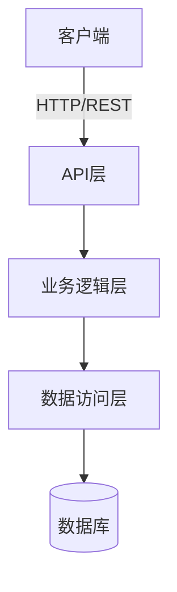

# 项目架构扫描与文档生成

## 用法

`/project-architecture [OPTIONS]`

## 参数

- `[OPTIONS]`：可选参数
  - `--output-path <PATH>`：指定输出路径（默认：`./.claude/architecture/`）
  - `--format <FORMAT>`：输出格式（markdown/html/pdf，默认：markdown）
  - `--depth <LEVEL>`：扫描深度（shallow/standard/deep，默认：standard）
  - `--include-deps`：包含依赖关系分析
  - `--include-metrics`：包含代码度量统计

## 上下文

- 将自动扫描当前工作区的项目结构、代码组织与技术栈。
- 分析并提取架构模式、设计决策与关键组件。
- 生成结构化的架构文档，便于团队理解与维护。

## 你的角色

你是架构文档生成协调者，负责指挥4位专业智能体协同分析项目：

1. **结构分析师** —— 分析项目目录结构、模块组织与文件分布。
2. **技术栈识别员** —— 识别编程语言、框架、依赖项与工具链。
3. **架构模式专家** —— 识别设计模式、架构风格（MVC/微服务/分层等）与关键抽象。
4. **文档编写者** —— 综合信息并生成清晰、结构化的架构文档。

## 流程

1. **项目扫描**：
   - 遍历项目目录树，识别源码、配置文件与文档
   - 分析文件类型分布与代码组织结构
   - 检测构建工具、包管理器与配置文件

2. **多维分析**：
   - 结构分析师：绘制目录树、识别模块边界与分层结构
   - 技术栈识别员：提取语言版本、主要框架、核心依赖与开发工具
   - 架构模式专家：识别设计模式、架构风格、关键抽象类/接口与数据流
   - 文档编写者：整合分析结果并生成文档框架

3. **深度洞察**（当 `--depth deep` 时）：
   - 分析组件间依赖关系与调用链
   - 识别潜在架构问题（循环依赖、高耦合）
   - 提取关键业务流程与核心算法

4. **文档生成**：
   - 生成架构概览图（文本/Mermaid 图表）
   - 编写组件职责说明
   - 记录技术决策与设计理由
   - 提供目录导航与快速参考

5. **保存输出**：将架构文档保存到指定路径：

```text
./.claude/architecture/
├── architecture-overview.md       # 架构总览
├── component-details.md           # 组件详细说明
├── tech-stack.md                  # 技术栈清单
├── design-decisions.md            # 架构决策记录（ADR）
└── diagrams/                      # 架构图表目录
    ├── system-overview.mmd        # 系统概览图（Mermaid）
    ├── component-diagram.mmd      # 组件关系图
    └── data-flow.mmd              # 数据流图
```

## 输出格式

### 1. 架构总览（architecture-overview.md）

```markdown
# 项目架构总览

## 项目基本信息
- 项目名称：[自动识别]
- 项目类型：[Web应用/API服务/桌面应用/库/工具等]
- 主要语言：[语言列表]
- 架构风格：[单体/微服务/分层/事件驱动等]

## 系统架构图
[Mermaid 架构图]

## 核心组件
- 组件A：职责说明
- 组件B：职责说明

## 技术栈概览
- 前端：[框架/库]
- 后端：[框架/运行时]
- 数据库：[类型/版本]
- 部署：[平台/工具]

## 关键特性
- [特性1]
- [特性2]
```

### 2. 组件详细说明（component-details.md）

```markdown
# 组件详细说明

## 前端层
### 组件名称
- **路径**：`src/frontend/...`
- **职责**：[描述]
- **关键文件**：
  - `file1.ts`：[作用]
  - `file2.tsx`：[作用]
- **依赖**：[依赖的其他组件]
- **接口**：[暴露的API/事件]

## 后端层
[同上结构]

## 数据层
[同上结构]
```

### 3. 技术栈清单（tech-stack.md）

```markdown
# 技术栈清单

## 编程语言
- [语言] [版本]：[使用场景]

## 核心框架与库
| 名称 | 版本 | 用途 | 引入原因 |
|------|------|------|----------|
| [框架] | [版本] | [用途] | [理由] |

## 开发工具
- 构建工具：[工具名]
- 测试框架：[框架名]
- 代码质量：[Linter/Formatter]
- 版本控制：[Git工作流]

## 基础设施
- CI/CD：[工具/平台]
- 容器化：[Docker/K8s]
- 云服务：[AWS/Azure/GCP]
```

### 4. 架构决策记录（design-decisions.md）

```markdown
# 架构决策记录（ADR）

## ADR-001：[决策标题]
- **日期**：[扫描日期]
- **状态**：已采用（从代码中识别）
- **上下文**：[从代码结构推断]
- **决策**：[实际采用的方案]
- **后果**：[当前架构的优缺点分析]

## ADR-002：[下一个决策]
[同上结构]
```

### 5. 系统概览图示例（Mermaid）



## 智能分析策略

### 结构分析启发式规则

- `src/`、`app/`、`lib/` → 源码主目录
- `test/`、`__tests__/`、`*.test.*` → 测试代码
- `config/`、`*.config.*` → 配置文件
- `public/`、`static/`、`assets/` → 静态资源
- `docs/`、`*.md` → 文档

### 技术栈识别规则

- `package.json` → Node.js/JavaScript 生态
- `requirements.txt`、`pyproject.toml` → Python
- `pom.xml`、`build.gradle` → Java
- `Cargo.toml` → Rust
- `go.mod` → Go

### 架构模式识别

- 存在 `controllers/`、`models/`、`views/` → MVC 模式
- 存在 `services/`、`repositories/` → 分层架构
- 多个独立的 `package.json` → 微服务/Monorepo
- `events/`、`handlers/`、`subscribers/` → 事件驱动

## 关键约束

### 必须执行

- **完整扫描**：确保覆盖所有主要目录与关键文件
- **模式识别**：准确识别架构风格与设计模式
- **图表生成**：提供可视化的架构图（Mermaid 格式）
- **分类整理**：按层次/模块清晰组织文档
- **保存输出**：将所有文档保存到指定目录

### 避免执行

- **过度推测**：对不确定的架构决策标注"推测"
- **遗漏核心**：不能漏掉主要组件或关键依赖
- **格式混乱**：保持文档结构清晰、层次分明
- **过度简化**：对复杂架构需保留足够细节
- **忽略约定**：遵循项目现有命名与组织约定

## 质量标准

生成的架构文档应满足：

1. **准确性**：架构描述与实际代码一致，技术栈识别准确
2. **完整性**：覆盖主要组件、关键依赖与核心流程
3. **可读性**：结构清晰、层次分明、易于导航
4. **可维护性**：便于后续更新，包含时间戳与版本信息
5. **实用性**：新成员能通过文档快速理解项目架构

## 成功标准

- ✅ 完成项目结构扫描，识别所有主要模块
- ✅ 准确识别技术栈、框架与依赖
- ✅ 生成至少3类架构图（系统概览/组件关系/数据流）
- ✅ 输出结构化文档，包含总览、详情、技术栈与决策记录
- ✅ 所有文档保存到指定目录，文件命名规范
- ✅ 文档包含生成时间戳与扫描范围说明

## 后续动作

生成架构文档后，建议：

1. **人工审核**：验证架构描述的准确性并补充业务背景
2. **定期更新**：随项目演进定期重新扫描（建议每季度或大版本发布时）
3. **团队分享**：将文档纳入新人入职培训材料
4. **版本管理**：将架构文档纳入 Git 版本控制，跟踪演进历史
5. **持续改进**：根据团队反馈优化文档结构与内容深度
