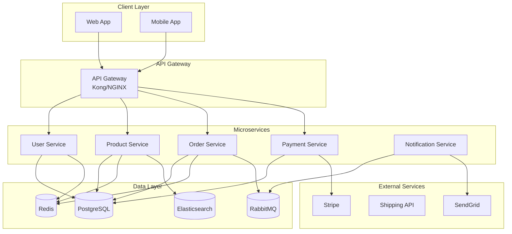
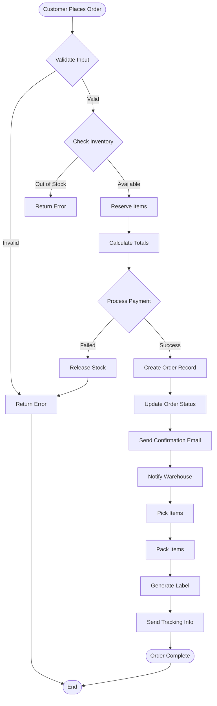
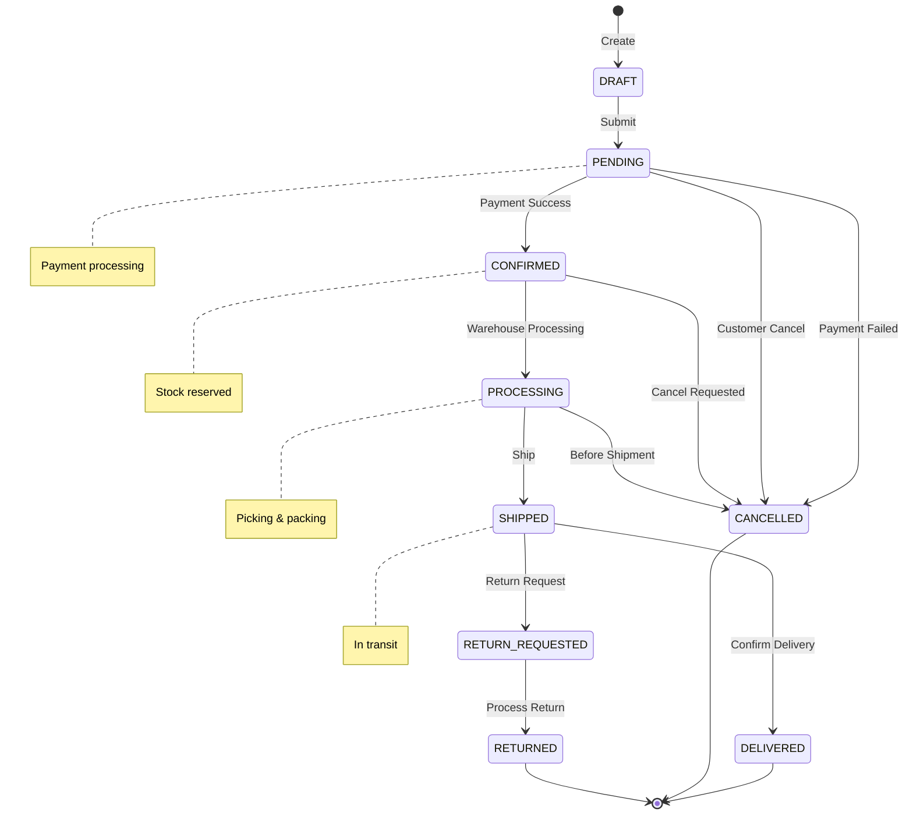
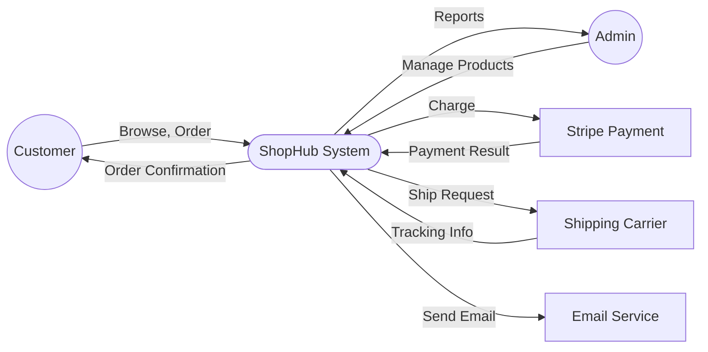
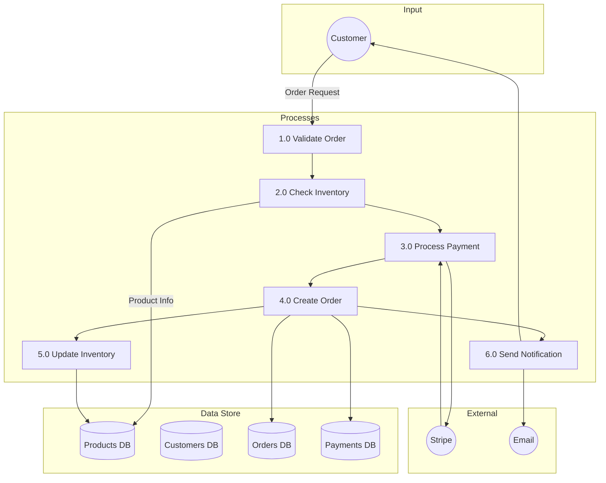
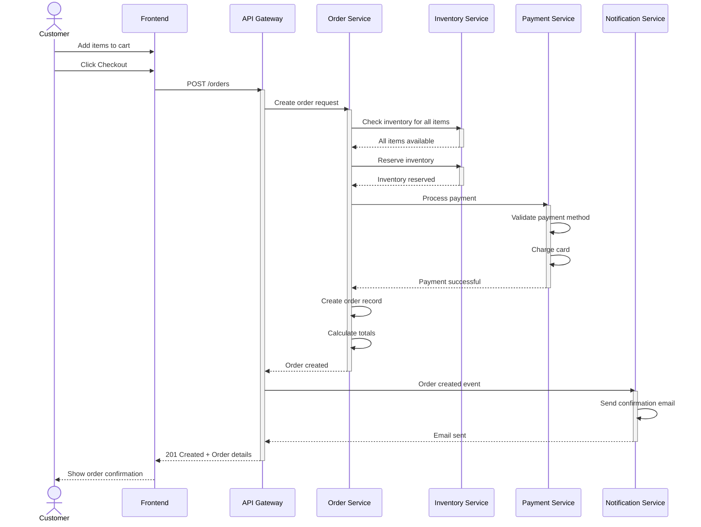
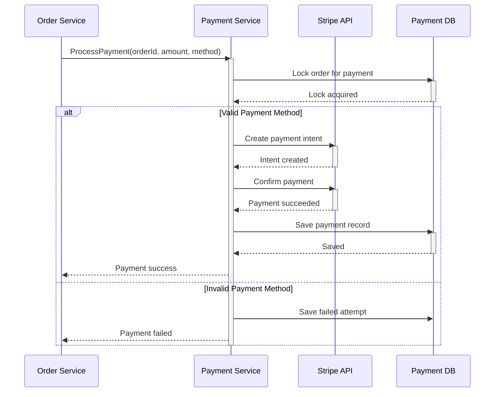
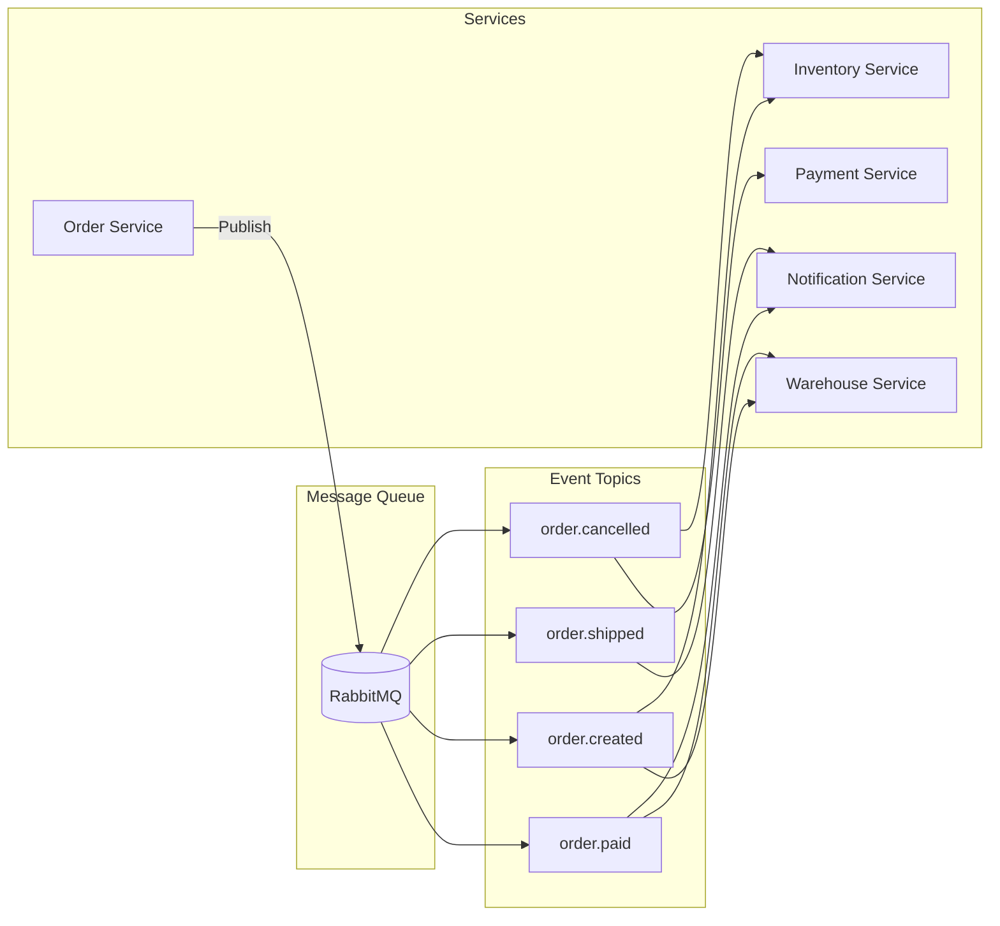
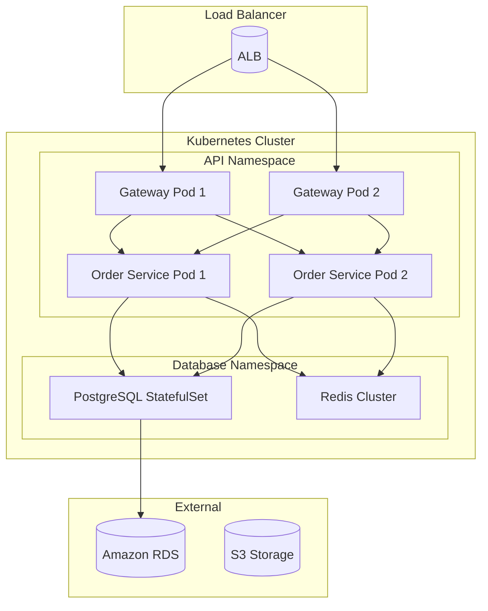

# E-Commerce Platform - Technical Design Document

## Project Overview

**Project Name:** ShopHub E-Commerce Platform
**Version:** 1.0.0
**Last Updated:** 2024-01-15
**Author:** Architecture Team

---

## 1. System Architecture

### 1.1 Architecture Overview



### 1.2 Technology Stack

| Layer | Technology |
|-------|-----------|
| **Frontend** | React 18, TypeScript, TailwindCSS |
| **Mobile** | React Native |
| **API Gateway** | Kong |
| **Backend** | Node.js, NestJS, TypeScript |
| **Database** | PostgreSQL 15 |
| **Cache** | Redis 7 |
| **Message Queue** | RabbitMQ |
| **Search** | Elasticsearch 8 |
| **Container** | Docker, Kubernetes |
| **CI/CD** | GitHub Actions, ArgoCD |

---

## 2. Database Design

### 2.1 Entity Relationship Diagram

```mermaid
erDiagram
    CUSTOMERS ||--o{ ORDERS : "places"
    CUSTOMERS ||--o{ ADDRESSES : "has"
    CUSTOMERS ||--o{ PAYMENT_METHODS : "owns"
    ORDERS ||--|{ ORDER_ITEMS : "contains"
    PRODUCTS ||--o{ ORDER_ITEMS : "ordered in"
    PRODUCTS }o--\| CATEGORIES : "belongs to"
    PRODUCTS ||--o{ PRODUCT_IMAGES : "has"
    ORDERS }o--o{ PAYMENTS : "paid by"
    ORDERS }o--o{ SHIPMENTS : "shipped via"

    CUSTOMERS {
        bigint id PK
        string email UK
        string password_hash
        string first_name
        string last_name
        boolean email_verified
        timestamp created_at
        timestamp updated_at
    }

    ORDERS {
        bigint id PK
        bigint customer_id FK
        string order_number UK
        string status
        decimal subtotal
        decimal tax
        decimal shipping
        decimal total
        timestamp created_at
        timestamp updated_at
    }

    PRODUCTS {
        bigint id PK
        string name
        text description
        decimal price
        integer stock_quantity
        bigint category_id FK
        boolean is_active
        timestamp created_at
    }

    ORDER_ITEMS {
        bigint id PK
        bigint order_id FK
        bigint product_id FK
        integer quantity
        decimal unit_price
        decimal subtotal
    }

    PAYMENTS {
        bigint id PK
        bigint order_id FK
        string provider
        string transaction_id
        decimal amount
        string status
        timestamp paid_at
    }

    SHIPMENTS {
        bigint id PK
        bigint order_id FK
        string carrier
        string tracking_number
        string status
        timestamp shipped_at
        timestamp delivered_at
    }
```

### 2.2 Table Definitions

#### Customers Table

| Column | Type | Nullable | Default | Description |
|--------|------|----------|---------|-------------|
| `id` | `bigint` | NO | `AUTO_INCREMENT` | Primary key |
| `email` | `varchar(255)` | NO | - | Unique email |
| `password_hash` | `varchar(255)` | NO | - | Bcrypt hash |
| `first_name` | `varchar(100)` | YES | `NULL` | First name |
| `last_name` | `varchar(100)` | YES | `NULL` | Last name |
| `phone` | `varchar(20)` | YES | `NULL` | Phone number |
| `email_verified` | `boolean` | NO | `false` | Email verified |
| `is_active` | `boolean` | NO | `true` | Account status |
| `created_at` | `timestamp` | NO | `NOW()` | Creation time |
| `updated_at` | `timestamp` | NO | `NOW()` | Last update |

**Indexes:**
- `PRIMARY KEY (id)`
- `UNIQUE INDEX idx_email (email)`
- `INDEX idx_active (is_active)`

#### Products Table

| Column | Type | Nullable | Default | Description |
|--------|------|----------|---------|-------------|
| `id` | `bigint` | NO | `AUTO_INCREMENT` | Primary key |
| `sku` | `varchar(50)` | NO | - | Stock keeping unit |
| `name` | `varchar(255)` | NO | - | Product name |
| `description` | `text` | YES | `NULL` | Description |
| `price` | `decimal(10,2)` | NO | `0.00` | Unit price |
| `compare_at_price` | `decimal(10,2)` | YES | `NULL` | Original price |
| `cost_price` | `decimal(10,2)` | YES | `NULL` | Cost price |
| `stock_quantity` | `integer` | NO | `0` | Available stock |
| `low_stock_threshold` | `integer` | NO | `10` | Low stock alert |
| `category_id` | `bigint` | YES | `NULL` | Category FK |
| `is_active` | `boolean` | NO | `true` | Active status |
| `weight` | `decimal(8,2)` | YES | `NULL` | Weight in kg |
| `created_at` | `timestamp` | NO | `NOW()` | Creation time |
| `updated_at` | `timestamp` | NO | `NOW()` | Last update |

**Indexes:**
- `PRIMARY KEY (id)`
- `UNIQUE INDEX idx_sku (sku)`
- `INDEX idx_category (category_id)`
- `INDEX idx_active_stock (is_active, stock_quantity)`

---

## 3. API Design

### 3.1 RESTful Endpoints

#### Authentication

| Method | Endpoint | Description |
|--------|----------|-------------|
| `POST` | `/api/v1/auth/register` | Register new customer |
| `POST` | `/api/v1/auth/login` | Customer login |
| `POST` | `/api/v1/auth/logout` | Customer logout |
| `POST` | `/api/v1/auth/refresh` | Refresh access token |
| `POST` | `/api/v1/auth/forgot-password` | Request password reset |
| `POST` | `/api/v1/auth/reset-password` | Reset password |

#### Products

| Method | Endpoint | Description |
|--------|----------|-------------|
| `GET` | `/api/v1/products` | List products (paginated) |
| `GET` | `/api/v1/products/{id}` | Get product details |
| `GET` | `/api/v1/products/search` | Search products |
| `GET` | `/api/v1/categories` | List categories |
| `GET` | `/api/v1/categories/{id}/products` | Products by category |

#### Orders

| Method | Endpoint | Description |
|--------|----------|-------------|
| `POST` | `/api/v1/orders` | Create order |
| `GET` | `/api/v1/orders` | List customer orders |
| `GET` | `/api/v1/orders/{id}` | Get order details |
| `PATCH` | `/api/v1/orders/{id}/cancel` | Cancel order |

### 3.2 Example API Contract

#### Create Order

**Request:**
```http
POST /api/v1/orders
Authorization: Bearer eyJhbGc...
Content-Type: application/json
```

```json
{
  "items": [
    {
      "product_id": 123,
      "quantity": 2
    },
    {
      "product_id": 456,
      "quantity": 1
    }
  ],
  "shipping_address": {
    "first_name": "John",
    "last_name": "Doe",
    "address_line1": "123 Main St",
    "city": "New York",
    "state": "NY",
    "postal_code": "10001",
    "country": "US",
    "phone": "+1 234 567 8900"
  },
  "billing_address": {
    "same_as_shipping": true
  },
  "shipping_method": "standard",
  "payment_method_id": "pm_abc123"
}
```

**Response (201 Created):**
```json
{
  "success": true,
  "data": {
    "id": 9999,
    "order_number": "ORD-2024-001234",
    "customer_id": 123,
    "status": "pending",
    "items": [
      {
        "id": 1,
        "product": {
          "id": 123,
          "name": "Wireless Headphones",
          "sku": "WH-001"
        },
        "quantity": 2,
        "unit_price": 79.99,
        "subtotal": 159.98
      }
    ],
    "subtotal": 209.97,
    "tax": 16.80,
    "shipping": 5.99,
    "total": 232.76,
    "created_at": "2024-01-15T10:30:00Z"
  }
}
```

---

## 4. Business Process Flows

### 4.1 Order Processing Flow



### 4.2 Order State Machine



---

## 5. Data Flow Diagrams

### 5.1 Context Diagram (Level 0 DFD)



### 5.2 Order Process DFD (Level 1)



---

## 6. Sequence Diagrams

### 6.1 Checkout Process



### 6.2 Payment Processing



---

## 7. Module Design

### 7.1 Service Interfaces

#### Order Service Interface

```typescript
interface IOrderService {
    // Order CRUD
    createOrder(dto: CreateOrderDTO): Promise<Order>;
    getOrderById(id: number): Promise<Order>;
    listOrders(filter: OrderFilter): Promise<PaginatedResult<Order>>;

    // Order Management
    updateStatus(id: number, status: OrderStatus): Promise<Order>;
    cancelOrder(id: number, reason: string): Promise<Order>;

    // Calculations
    calculateSubtotal(items: OrderItemDTO[]): Promise<number>;
    calculateTax(subtotal: number, address: Address): Promise<number>;
    calculateShipping(weight: number, method: ShippingMethod): Promise<number>;
}

interface CreateOrderDTO {
    customerId: number;
    items: OrderItemDTO[];
    shippingAddress: AddressDTO;
    billingAddress: AddressDTO;
    shippingMethod: ShippingMethod;
    paymentMethodId: string;
    promoCode?: string;
}

type OrderStatus =
    | 'draft'
    | 'pending'
    | 'confirmed'
    | 'processing'
    | 'shipped'
    | 'delivered'
    | 'cancelled'
    | 'refunded';
```

#### Inventory Service Interface

```typescript
interface IInventoryService {
    // Stock Management
    checkAvailability(items: OrderItemDTO[]): Promise<StockCheckResult>;
    reserveItems(orderId: number, items: OrderItemDTO[]): Promise<void>;
    releaseReservation(orderId: number): Promise<void>;

    // Inventory Operations
    adjustStock(productId: number, quantity: number, reason: string): Promise<void>;
    getStockLevel(productId: number): Promise<StockLevel>;
    listLowStockProducts(threshold?: number): Promise<Product[]>;
}

interface StockCheckResult {
    available: boolean;
    unavailableItems: Array<{
        productId: number;
        requested: number;
        available: number;
    }>;
}

interface StockLevel {
    productId: number;
    quantity: number;
    reserved: number;
    available: number;
    status: 'in_stock' | 'low_stock' | 'out_of_stock';
}
```

### 7.2 Event-Driven Communication



**Event Schemas:**

```typescript
// Order Created Event
interface OrderCreatedEvent {
    eventType: 'order.created';
    eventId: string;
    timestamp: Date;
    data: {
        orderId: number;
        orderNumber: string;
        customerId: number;
        items: Array<{
            productId: number;
            quantity: number;
            unitPrice: number;
        }>;
        total: number;
    };
}

// Order Paid Event
interface OrderPaidEvent {
    eventType: 'order.paid';
    eventId: string;
    timestamp: Date;
    data: {
        orderId: number;
        paymentId: number;
        amount: number;
        paymentMethod: string;
    };
}
```

---

## 8. Security Considerations

### 8.1 Authentication & Authorization

| Feature | Implementation |
|---------|----------------|
| **Authentication** | JWT access tokens (15 min) + Refresh tokens (30 days) |
| **Password** | Bcrypt with salt rounds = 12 |
| **Multi-factor** | TOTP via authenticator app (optional for users) |
| **Authorization** | Role-based access control (RBAC) |
| **API Security** | API keys for external integrations |

### 8.2 Data Protection

| Data Type | Protection |
|-----------|------------|
| Passwords | Bcrypt hash, never logged |
| PII | Encrypted at rest (AES-256) |
| Payment data | PCI DSS compliance, never stored |
| API logs | Sanitized, no sensitive data |

### 8.3 Rate Limiting

| Endpoint Type | Limit | Window |
|---------------|-------|--------|
| Public API | 100 requests | 15 minutes |
| Authenticated | 1000 requests | 15 minutes |
| Auth endpoints | 5 attempts | 15 minutes |

---

## 9. Deployment Architecture



---

## 10. Monitoring & Observability

### 10.1 Metrics

| Metric | Type | Threshold |
|--------|------|-----------|
| `order_create_duration` | Histogram | p95 < 500ms |
| `payment_success_rate` | Gauge | > 95% |
| `api_error_rate` | Gauge | < 1% |
| `inventory_check_duration` | Histogram | p95 < 100ms |

### 10.2 Alerts

| Alert | Condition | Severity |
|-------|-----------|----------|
| High error rate | error_rate > 5% | Critical |
| Payment failures | payment_success < 90% | High |
| Slow API | p95_latency > 2s | Medium |
| Low inventory | stock < threshold | Low |

---

## Appendix A: Glossary

| Term | Definition |
|------|------------|
| **SKU** | Stock Keeping Unit - unique identifier for products |
| **Order Item** | Individual product line in an order |
| **Fulfillment** | Process of preparing and shipping an order |
| **Chargeback** | Payment reversal initiated by customer |

---

## Appendix B: Change Log

| Version | Date | Changes |
|---------|------|---------|
| 1.0.0 | 2024-01-15 | Initial design document |
