# Design Patterns Reference

## Table of Contents
1. [Architectural Patterns](#architectural-patterns)
2. [Layer Responsibilities](#layer-responsibilities)
3. [Communication Patterns](#communication-patterns)
4. [Data Patterns](#data-patterns)
5. [Integration Patterns](#integration-patterns)

---

## Architectural Patterns

### Layered Architecture

**Description:** Organizes code into horizontal layers with clear dependencies.

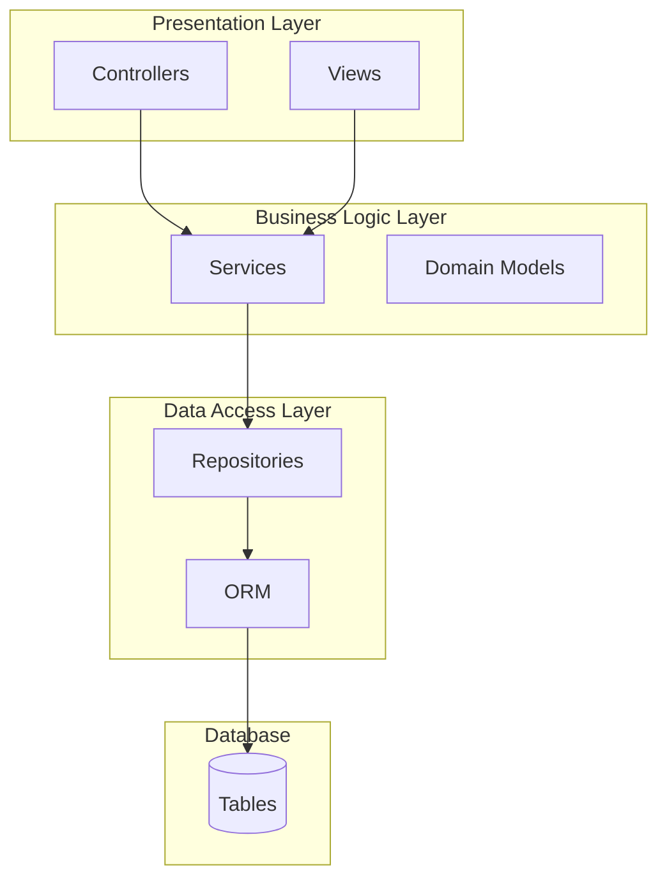

**Layers:**
1. **Presentation Layer** - UI, API controllers
2. **Business Logic Layer** - Services, business rules
3. **Data Access Layer** - Repositories, ORM

**When to Use:**
- Traditional CRUD applications
- Small to medium teams
- Clear separation of concerns needed

**Trade-offs:**
- ✅ Simple to understand
- ✅ Easy to test
- ❌ Can become rigid
- ❌ Changes may cascade through layers

---

### Hexagonal Architecture (Ports and Adapters)

**Description:** Business logic at the center, surrounded by adapters for external concerns.

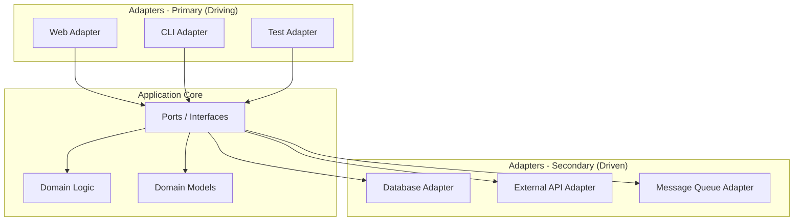

**Key Concepts:**
- **Ports** - Interfaces defined by the core
- **Adapters** - Implementations of ports
- **Core** - Pure business logic, no framework dependencies

**When to Use:**
- Complex business domains
- Multiple external integrations
- Testability is critical

**Trade-offs:**
- ✅ Highly testable
- ✅ Flexible technology choices
- ✅ Business logic isolated
- ❌ More initial complexity
- ❌ More files/interfaces

---

### Clean Architecture

**Description:** Concentric circles of dependency, with business rules at the center.

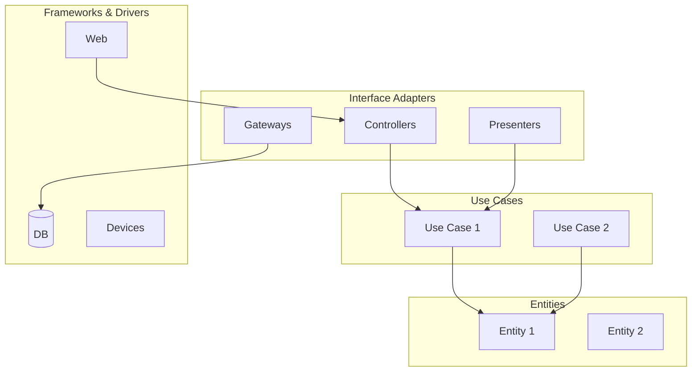

**Dependency Rule:** Dependencies point inward only.

**Layers (outer to inner):**
1. **Frameworks & Drivers** - External tools
2. **Interface Adapters** - Convert data formats
3. **Use Cases** - Application-specific business rules
4. **Entities** - Enterprise-wide business rules

**When to Use:**
- Enterprise applications
- Long-lived projects
- Multiple teams

---

### Microservices Architecture

**Description:** Decomposes application into small, independent services.

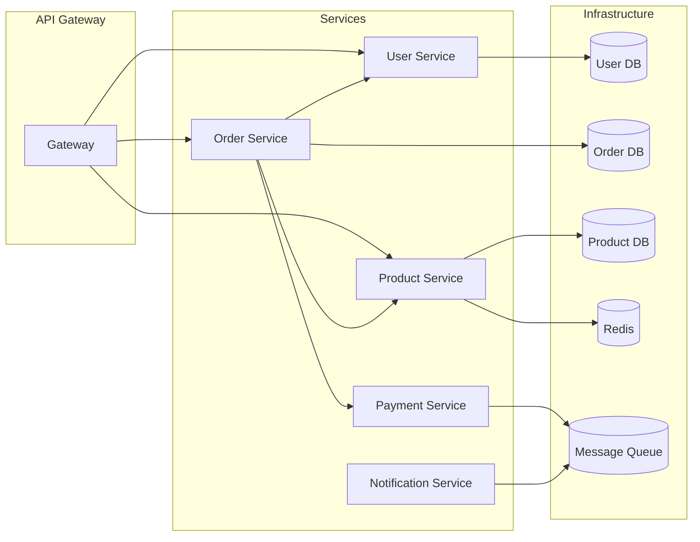

**Key Characteristics:**
- Single responsibility per service
- Independent deployment
- Own database per service
- Communication via API or events

**When to Use:**
- Large applications with clear domains
- Multiple teams working independently
- Need for independent scaling

**Trade-offs:**
- ✅ Independent deployment/scaling
- ✅ Technology diversity
- ✅ Fault isolation
- ❌ Distributed complexity
- ❌ Data consistency challenges
- ❌ Operational overhead

---

## Layer Responsibilities

### Presentation Layer

**Responsibilities:**
- Handle HTTP requests/responses
- Input validation (syntactic)
- Response formatting
- Authentication (token validation)

**Should NOT:**
- Contain business logic
- Access database directly
- Make external API calls

**Example:**
```typescript
// ✅ Good: Thin controller
@Post('/users')
async createUser(@Body() dto: CreateUserDTO) {
    return this.userService.create(dto);
}

// ❌ Bad: Business logic in controller
@Post('/users')
async createUser(@Body() dto: CreateUserDTO) {
    if (dto.age < 18) {
        throw new Error('Too young');
    }
    // ... more logic
}
```

---

### Business Logic Layer

**Responsibilities:**
- Implement business rules
- Coordinate workflows
- Validate business constraints
- Manage transactions

**Should NOT:**
- Handle HTTP concerns
- Know about presentation format

**Example:**
```typescript
// ✅ Good: Business logic in service
async createOrder(dto: CreateOrderDTO) {
    // Business rule: Check user eligibility
    const user = await this.getUser(dto.userId);
    if (!user.isVerified) {
        throw new NotEligibleError();
    }

    // Business rule: Validate inventory
    await this.validateInventory(dto.items);

    // Business rule: Calculate discounts
    const total = this.calculateTotal(dto);

    return this.orderRepository.save(order);
}
```

---

### Data Access Layer

**Responsibilities:**
- Database operations
- Query optimization
- Mapping to domain models
- Transaction management

**Should NOT:**
- Contain business logic
- Validate business rules

---

## Communication Patterns

### Synchronous (Request/Response)

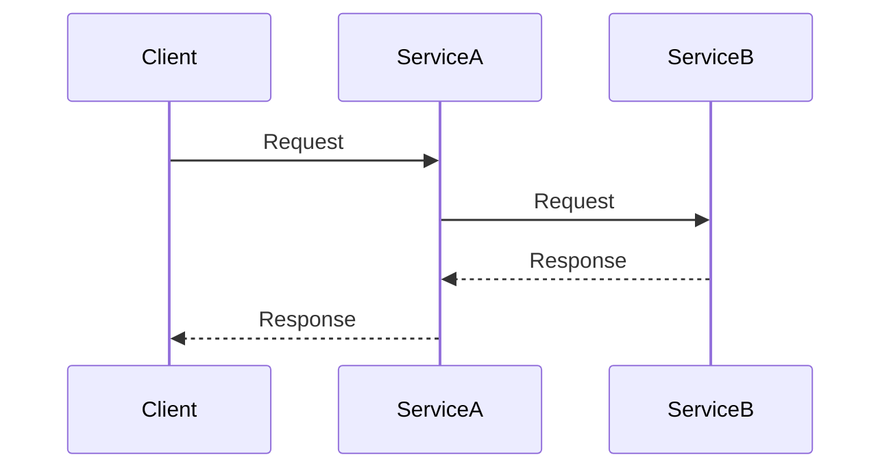

**Use When:**
- Immediate response needed
- Data consistency required
- Simple call chain

**Risks:**
- Cascading failures
- Latency accumulation
- Tight coupling

---

### Asynchronous (Event-Driven)

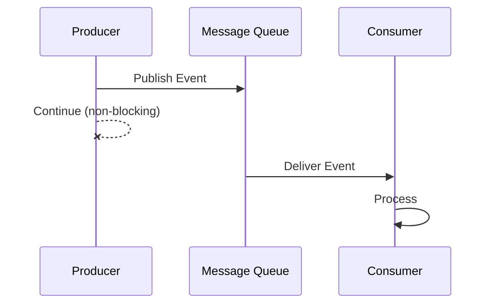

**Use When:**
- Immediate response not needed
- Background processing
- Decoupling required
- Broadcast notifications

**Patterns:**

| Pattern | Description |
|---------|-------------|
| **Event Notification** | Fire and forget |
| **Event-Carried State Transfer** | Event contains all needed data |
| **Event Sourcing** | Store all events as log |
| **CQRS** | Separate read/write models |

---

### Saga Pattern (Distributed Transactions)

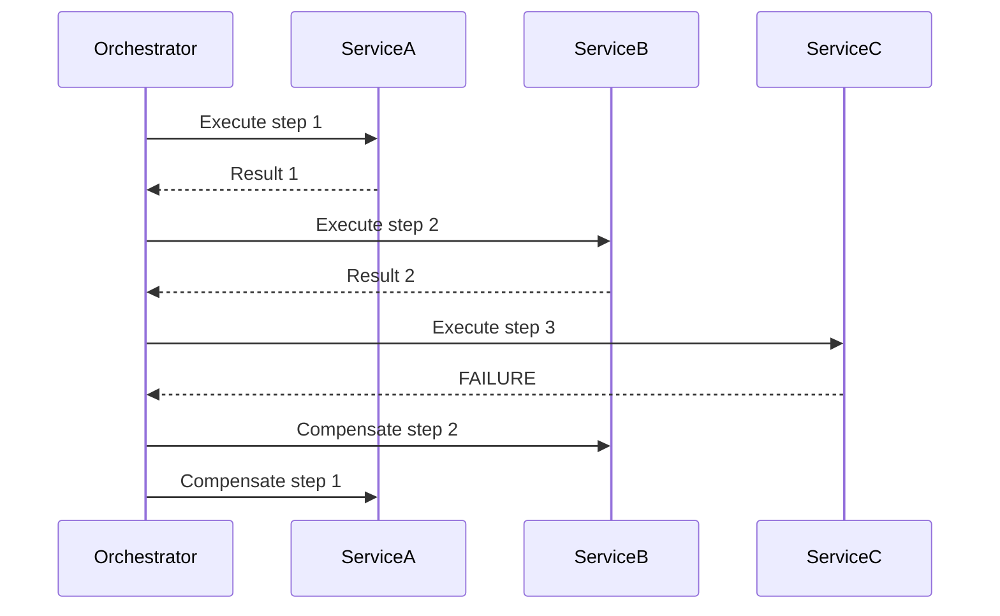

**Types:**
- **Choreography** - Services communicate directly via events
- **Orchestration** - Central coordinator manages saga

---

## Data Patterns

### Repository Pattern

**Description:** Abstract data access behind interface.

```typescript
interface IUserRepository {
    findById(id: number): Promise<User | null>;
    findByEmail(email: string): Promise<User | null>;
    save(user: User): Promise<User>;
    delete(id: number): Promise<void>;
}

class SQLUserRepository implements IUserRepository {
    async findById(id: number) {
        return this.db.query('SELECT * FROM users WHERE id = ?', [id]);
    }
}
```

**Benefits:**
- Swappable data source
- Testable (easy to mock)
- Centralized query logic

---

### Unit of Work Pattern

**Description:** Track changes and commit as transaction.

```typescript
class UnitOfWork {
    private readonly repositories = new Map();
    private readonly newEntities = [];
    private readonly modifiedEntities = [];
    private readonly deletedEntities = [];

    registerNew(entity) {
        this.newEntities.push(entity);
    }

    registerDirty(entity) {
        this.modifiedEntities.push(entity);
    }

    registerDeleted(entity) {
        this.deletedEntities.push(entity);
    }

    async commit() {
        await this.beginTransaction();
        try {
            await this.insertNew();
            await this.updateModified();
            await this.deleteDeleted();
            await this.commitTransaction();
        } catch (e) {
            await this.rollbackTransaction();
            throw e;
        }
    }
}
```

---

### CQRS (Command Query Responsibility Segregation)

**Description:** Separate models for reads and writes.

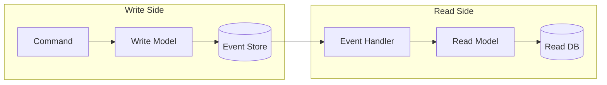

**When to Use:**
- Complex read queries
- High read/write ratio
- Different data shapes for read/write

---

## Integration Patterns

### API Gateway Pattern

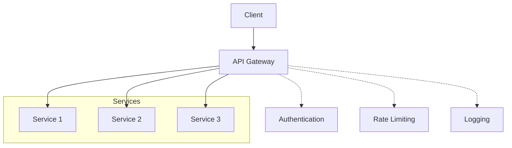

**Responsibilities:**
- Request routing
- Authentication/authorization
- Rate limiting
- Response aggregation
- Protocol translation

---

### Circuit Breaker Pattern

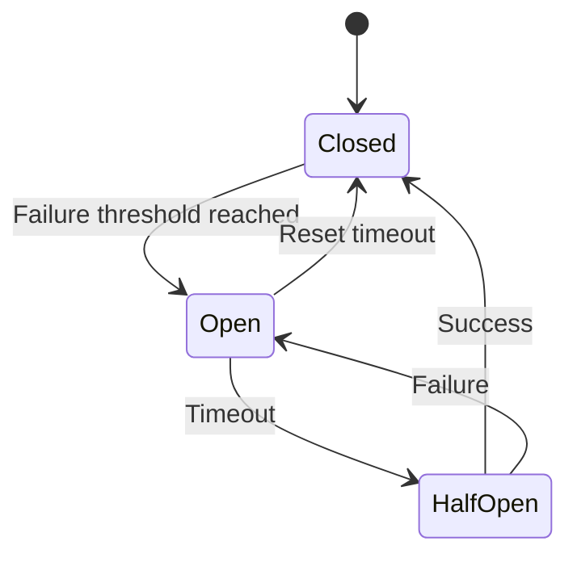

**States:**
- **Closed** - Normal operation, requests pass through
- **Open** - Failures detected, requests fail immediately
- **HalfOpen** - Testing if service has recovered

---

### Bulkhead Pattern

**Description:** Isolate resources to prevent cascading failures.

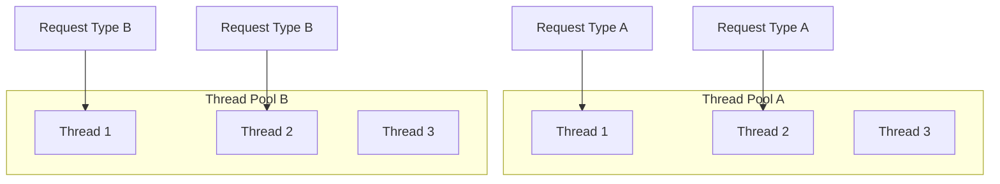

**Benefits:**
- Resource isolation
- Priority management
- Fault containment
