# Mermaid Diagrams Reference

## Table of Contents
1. [Flowchart](#flowchart)
2. [Sequence Diagram](#sequence-diagram)
3. [Entity Relationship Diagram](#entity-relationship-diagram)
4. [State Diagram](#state-diagram)
5. [Class Diagram](#class-diagram)
6. [User Journey](#user-journey)
7. [Gantt Chart](#gantt-chart)
8. [Pie Chart](#pie-chart)
9. [Mindmap](#mindmap)

---

## Flowchart

### Basic Syntax

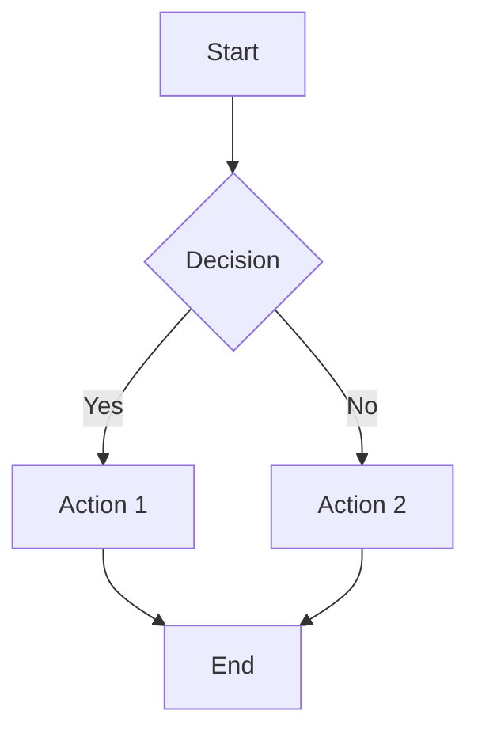

### Direction Indicators

| Code | Direction |
|------|-----------|
| `TD` | Top to Down |
| `DT` | Down to Top |
| `LR` | Left to Right |
| `RL` | Right to Left |

### Node Shapes

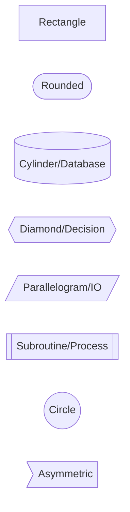

### Styling

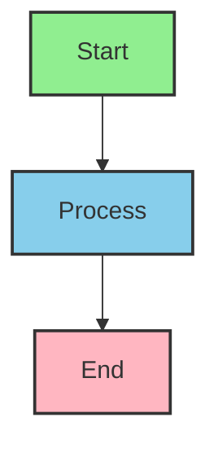

### Subgraphs (Swimlanes)

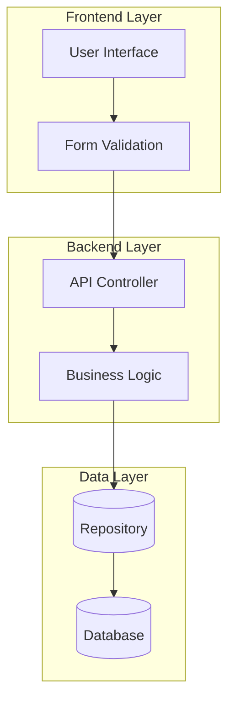

### Business Process Example

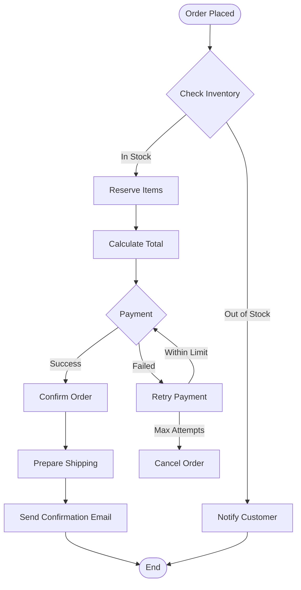

---

## Sequence Diagram

### Basic Syntax

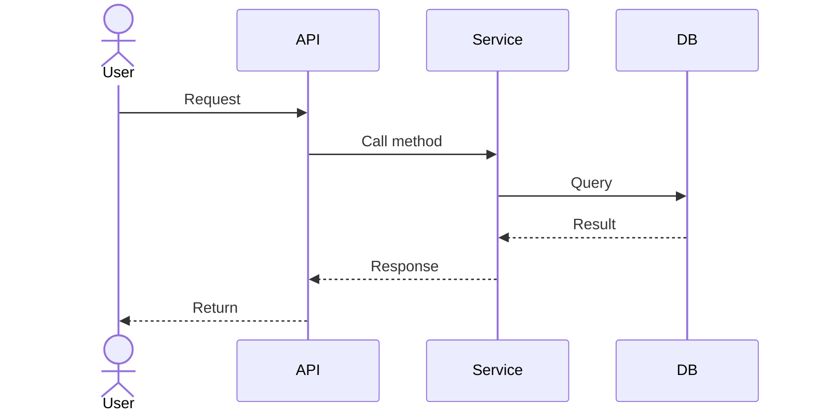

### Participants

| Syntax | Type |
|--------|------|
| `actor` | External actor |
| `participant` | Standard participant |
| `boundary` | System boundary |
| `control` | Controller |
| `entity` | Entity |
| `database` | Database |

### Message Types

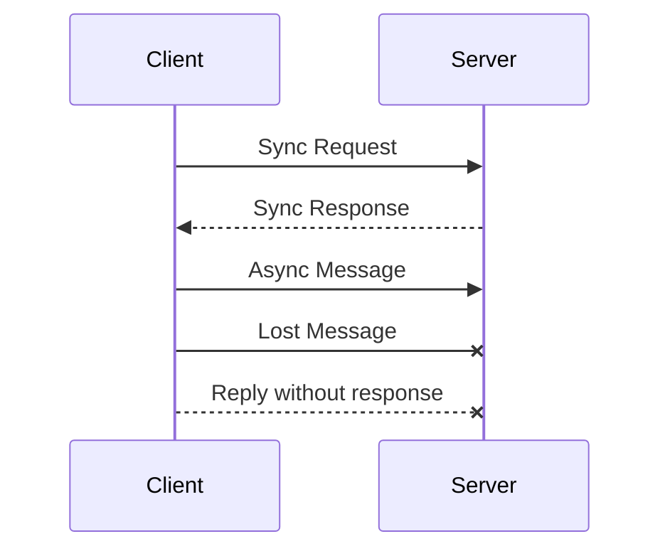

### Loops and Alternatives

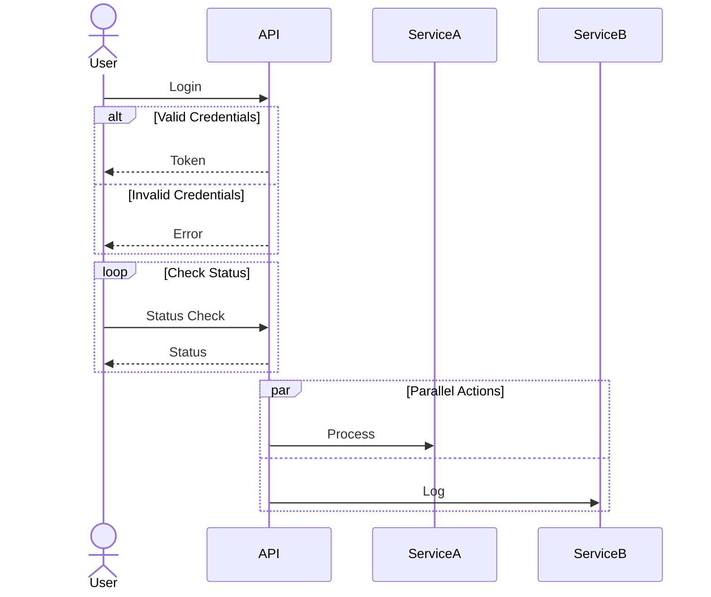

### Activation Boxes

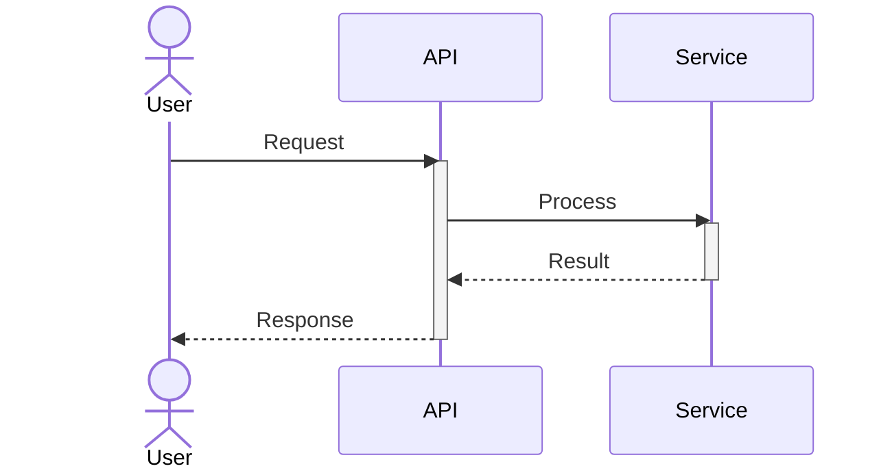

### Complex Example: Order Processing

```mermaid
sequenceDiagram
    actor Customer
    participant OrderAPI
    participant InventoryService
    participant PaymentService
    participant ShippingService
    participant Database

    Customer->>OrderAPI: POST /orders
    activate OrderAPI

    OrderAPI->>InventoryService: Check availability
    activate InventoryService
    InventoryService->>Database: Query stock
    Database-->>InventoryService: Stock level
    InventoryService-->>OrderAPI: Available
    deactivate InventoryService

    alt Items Available
        OrderAPI->>InventoryService: Reserve items
        activate InventoryService
        InventoryService->>Database: Update stock
        InventoryService-->>OrderAPI: Reserved
        deactivate InventoryService

        OrderAPI->>PaymentService: Process payment
        activate PaymentService

        alt Payment Success
            PaymentService->>Database: Save transaction
            PaymentService-->>OrderAPI: Payment confirmed
            deactivate PaymentService

            OrderAPI->>Database: Create order
            OrderAPI->>ShippingService: Initiate shipping
            activate ShippingService
            ShippingService-->>OrderAPI: Shipment created
            deactivate ShippingService

            OrderAPI-->>Customer: 201 Created (Order #123)
        else Payment Failed
            PaymentService-->>OrderAPI: Payment declined
            deactivate PaymentService

            OrderAPI->>InventoryService: Release reservation
            OrderAPI-->>Customer: 402 Payment Required
        end
    else Items Not Available
        OrderAPI-->>Customer: 400 Out of Stock
    end

    deactivate OrderAPI
```

---

## Entity Relationship Diagram

### Basic Syntax

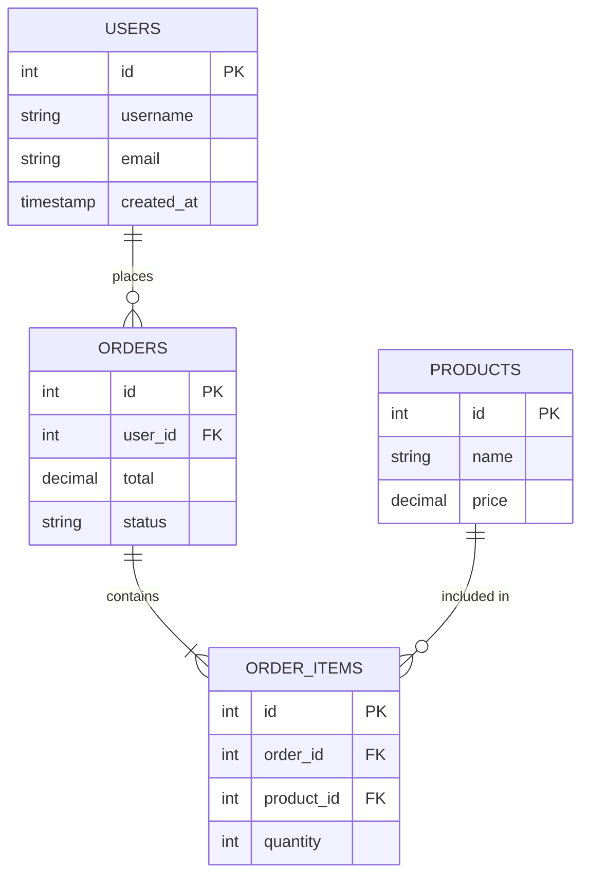

### Relationship Types

| Syntax | Cardinality | Description |
|--------|-------------|-------------|
| `\|\|--o{` | One-to-Many or Zero | Parent has many optional children |
| `\|\|--\|{` | One-to-Many | Parent has many required children |
| `\|\|--\|\|` | One-to-One | Exactly one related record |
| `o\|--o{` | Zero or One to Many or Zero |

### Advanced Example

```mermaid
erDiagram
    CUSTOMERS ||--o{ ORDERS : "places"
    CUSTOMERS ||--o{ ADDRESSES : "has"
    ORDERS ||--|{ ORDER_ITEMS : "contains"
    PRODUCTS ||--o{ ORDER_ITEMS : "ordered in"
    PRODUCTS }o--\| CATEGORIES : "belongs to"
    ORDERS }o--\| PAYMENTS : "paid by"
    ORDERS }o--o{ SHIPMENTS : "shipped via"

    CUSTOMERS {
        bigint id PK
        string email UK
        string password_hash
        string first_name
        string last_name
        boolean is_active
        timestamp created_at
    }

    ORDERS {
        bigint id PK
        bigint customer_id FK
        string order_number UK
        decimal subtotal
        decimal tax
        decimal total
        string status
        timestamp created_at
    }

    PRODUCTS {
        bigint id PK
        string name
        string description
        decimal price
        int stock_quantity
        boolean is_active
    }

    ORDER_ITEMS {
        bigint id PK
        bigint order_id FK
        bigint product_id FK
        int quantity
        decimal unit_price
        decimal subtotal
    }

    CATEGORIES {
        bigint id PK
        string name
        bigint parent_id FK
    }

    PAYMENTS {
        bigint id PK
        bigint order_id FK
        string provider
        string transaction_id
        decimal amount
        string status
        timestamp paid_at
    }
```

---

## State Diagram

### Basic Syntax

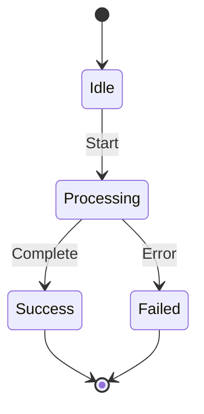

### Composite States

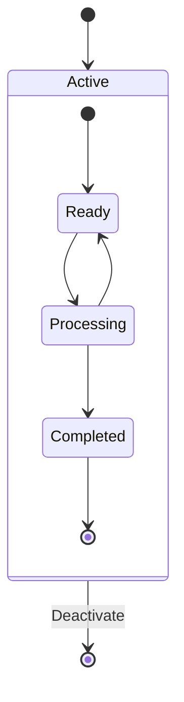

### Order State Example

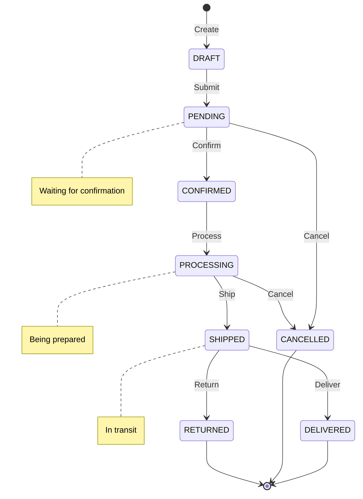

---

## Class Diagram

### Basic Syntax

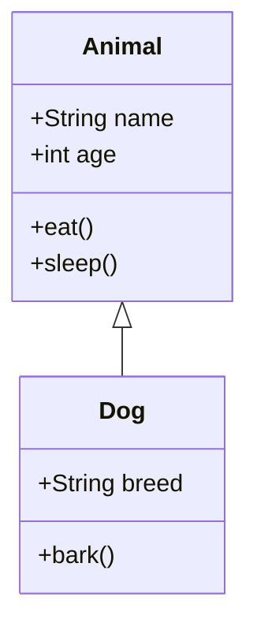

### Relationships

| Symbol | Relationship |
|--------|--------------|
| `<|--` | Inheritance |
| `*--` | Composition |
| `o--` | Aggregation |
| `-->` | Association |
| `..>` | Dependency |

### Complete Example

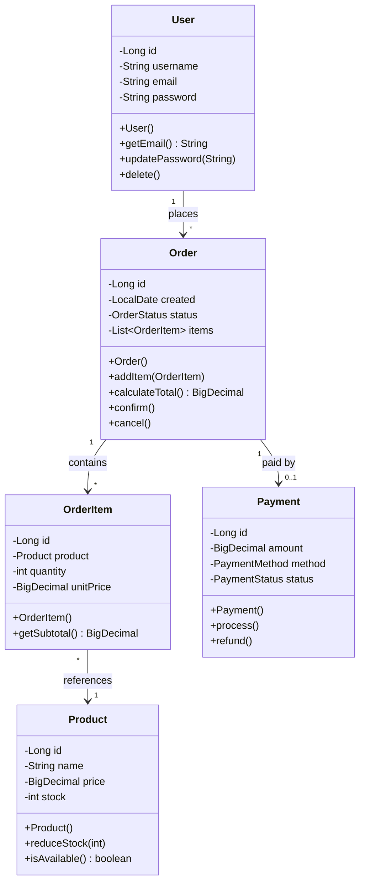

---

## User Journey

### Basic Syntax

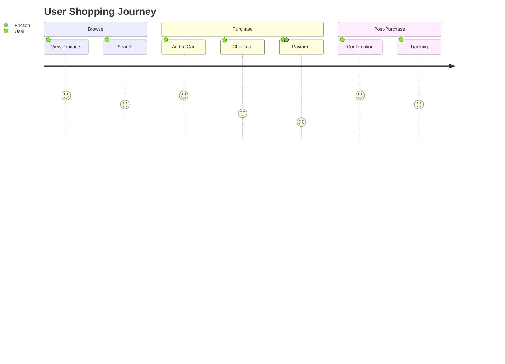

---

## Gantt Chart

### Project Timeline

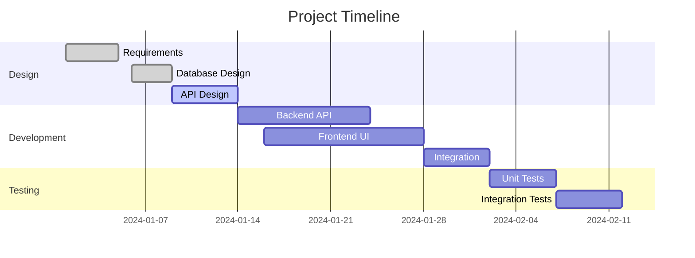

---

## Pie Chart

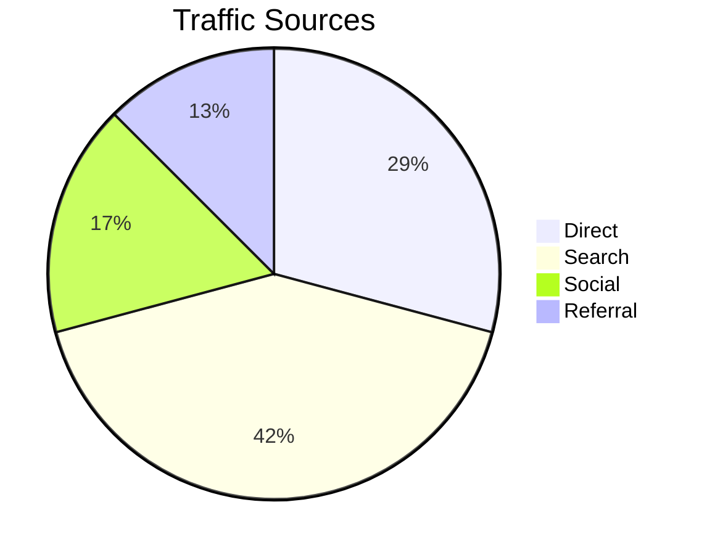

---

## Mindmap

```mermaid
mindmap
    root((E-Commerce))
        Frontend
            React
            TailwindCSS
            Redux
        Backend
            API Gateway
            User Service
            Order Service
            Product Service
        Database
            PostgreSQL
            Redis Cache
        Infrastructure
            AWS
            Docker
            Kubernetes
```

---

## Best Practices

### Diagram Naming
- Use descriptive titles
- Keep node labels concise
- Use consistent terminology

### Complexity Management
- Split complex diagrams into multiple views
- Use subgraphs for grouping
- Apply layering (L-R, T-D)

### Styling
- Use colors purposefully (not randomly)
- Maintain consistent color scheme
- High contrast for readability

### Documentation
- Add notes for complex logic
- Include legends for symbols
- Document assumptions
