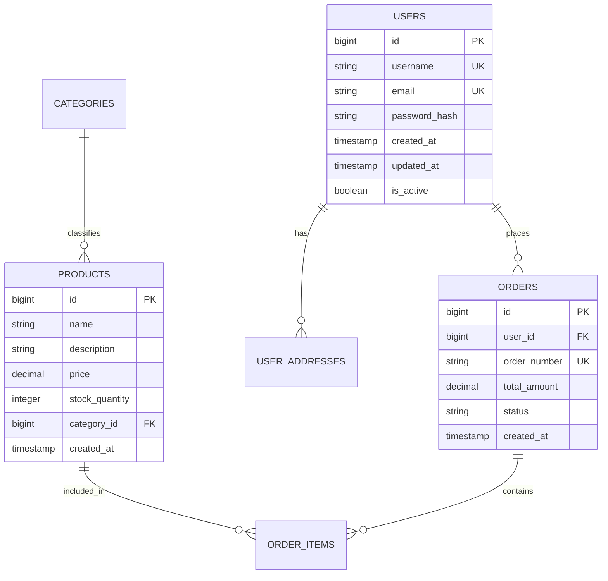

# Database Schema Template

## Overview
**Project:** [Project Name]
**Database:** [PostgreSQL / MySQL / MongoDB / etc.]
**Version:** 1.0.0
**Last Updated:** [Date]

---

## Entity Relationship Diagram



---

## Table Definitions

### Table: `users`

| Column | Type | Nullable | Default | Description |
|--------|------|----------|---------|-------------|
| `id` | `bigint` | NO | `AUTO_INCREMENT` | Primary key |
| `username` | `varchar(50)` | NO | - | Unique username |
| `email` | `varchar(255)` | NO | - | Unique email address |
| `password_hash` | `varchar(255)` | NO | - | Bcrypt hashed password |
| `first_name` | `varchar(100)` | YES | NULL | User's first name |
| `last_name` | `varchar(100)` | YES | NULL | User's last name |
| `is_active` | `boolean` | NO | `true` | Account status |
| `created_at` | `timestamp` | NO | `CURRENT_TIMESTAMP` | Creation timestamp |
| `updated_at` | `timestamp` | NO | `CURRENT_TIMESTAMP` | Last update timestamp |

**Indexes:**
- `PRIMARY KEY (id)`
- `UNIQUE KEY idx_username (username)`
- `UNIQUE KEY idx_email (email)`
- `INDEX idx_active (is_active)`

**Relationships:**
- Has many `orders` via `user_id`
- Has many `user_addresses` via `user_id`

---

### Table: `orders`

| Column | Type | Nullable | Default | Description |
|--------|------|----------|---------|-------------|
| `id` | `bigint` | NO | `AUTO_INCREMENT` | Primary key |
| `user_id` | `bigint` | NO | - | Foreign key to users |
| `order_number` | `varchar(50)` | NO | - | Unique order identifier |
| `status` | `enum` | NO | `'pending'` | Order status |
| `total_amount` | `decimal(10,2)` | NO | `0.00` | Order total |
| `notes` | `text` | YES | NULL | Customer notes |
| `created_at` | `timestamp` | NO | `CURRENT_TIMESTAMP` | Order date |
| `updated_at` | `timestamp` | NO | `CURRENT_TIMESTAMP` | Last update |

**Indexes:**
- `PRIMARY KEY (id)`
- `UNIQUE KEY idx_order_number (order_number)`
- `INDEX idx_user_id (user_id)`
- `INDEX idx_status (status)`
- `INDEX idx_created_at (created_at)`

**Relationships:**
- Belongs to `users` via `user_id`
- Has many `order_items` via `order_id`

**Enums:**
- `status`: `pending`, `confirmed`, `processing`, `shipped`, `delivered`, `cancelled`

---

## Relationships

| Parent Table | Child Table | Relationship | Cardinality |
|--------------|-------------|--------------|-------------|
| `users` | `orders` | One-to-Many | 1:N |
| `users` | `user_addresses` | One-to-Many | 1:N |
| `orders` | `order_items` | One-to-Many | 1:N |
| `products` | `order_items` | One-to-Many | 1:N |
| `categories` | `products` | One-to-Many | 1:N |

---

## DDL Statements

```sql
-- Users Table
CREATE TABLE users (
    id BIGINT AUTO_INCREMENT PRIMARY KEY,
    username VARCHAR(50) NOT NULL UNIQUE,
    email VARCHAR(255) NOT NULL UNIQUE,
    password_hash VARCHAR(255) NOT NULL,
    first_name VARCHAR(100),
    last_name VARCHAR(100),
    is_active BOOLEAN NOT NULL DEFAULT TRUE,
    created_at TIMESTAMP NOT NULL DEFAULT CURRENT_TIMESTAMP,
    updated_at TIMESTAMP NOT NULL DEFAULT CURRENT_TIMESTAMP ON UPDATE CURRENT_TIMESTAMP,
    INDEX idx_active (is_active)
) ENGINE=InnoDB DEFAULT CHARSET=utf8mb4 COLLATE=utf8mb4_unicode_ci;

-- Orders Table
CREATE TABLE orders (
    id BIGINT AUTO_INCREMENT PRIMARY KEY,
    user_id BIGINT NOT NULL,
    order_number VARCHAR(50) NOT NULL UNIQUE,
    status ENUM('pending', 'confirmed', 'processing', 'shipped', 'delivered', 'cancelled') NOT NULL DEFAULT 'pending',
    total_amount DECIMAL(10,2) NOT NULL DEFAULT 0.00,
    notes TEXT,
    created_at TIMESTAMP NOT NULL DEFAULT CURRENT_TIMESTAMP,
    updated_at TIMESTAMP NOT NULL DEFAULT CURRENT_TIMESTAMP ON UPDATE CURRENT_TIMESTAMP,
    FOREIGN KEY (user_id) REFERENCES users(id) ON DELETE RESTRICT,
    INDEX idx_user_id (user_id),
    INDEX idx_status (status),
    INDEX idx_created_at (created_at)
) ENGINE=InnoDB DEFAULT CHARSET=utf8mb4 COLLATE=utf8mb4_unicode_ci;
```

---

## Index Strategy

### Primary Indexes
- All primary keys use auto-increment big integers
- Ensures efficient insert and lookup operations

### Unique Indexes
- Applied to natural keys (username, email, order_number)
- Enforces data integrity at database level

### Foreign Key Indexes
- All foreign key columns are indexed
- Optimizes JOIN operations and cascade operations

### Composite Indexes
| Index | Columns | Use Case |
|-------|---------|----------|
| `idx_user_status` | `(user_id, status)` | Filter user orders by status |
| `idx_product_category` | `(category_id, created_at)` | Browse products by category |

### Query Optimization Notes
- Add indexes based on actual query patterns
- Monitor slow query log for optimization opportunities
- Consider covering indexes for frequent query patterns

---

## Data Integrity

### Constraints
- `NOT NULL` on required fields
- `UNIQUE` on natural keys
- `CHECK` constraints for data validation (if supported)

### Cascading Rules
| Relationship | On Delete | On Update |
|--------------|-----------|-----------|
| orders → users | RESTRICT | CASCADE |
| order_items → orders | CASCADE | CASCADE |
| order_items → products | RESTRICT | CASCADE |

---

## Migration History

| Version | Date | Description |
|---------|------|-------------|
| 1.0.0 | [Date] | Initial schema creation |
| 1.0.1 | [Date] | Added index on orders.status |
| 1.1.0 | [Date] | Added user_addresses table |
