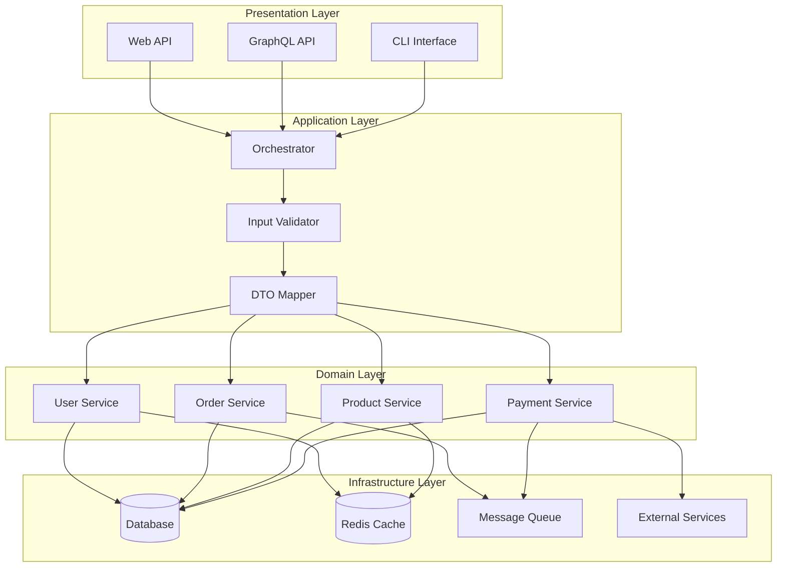
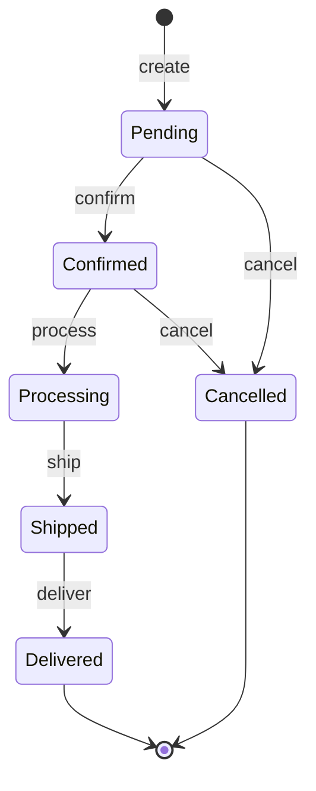
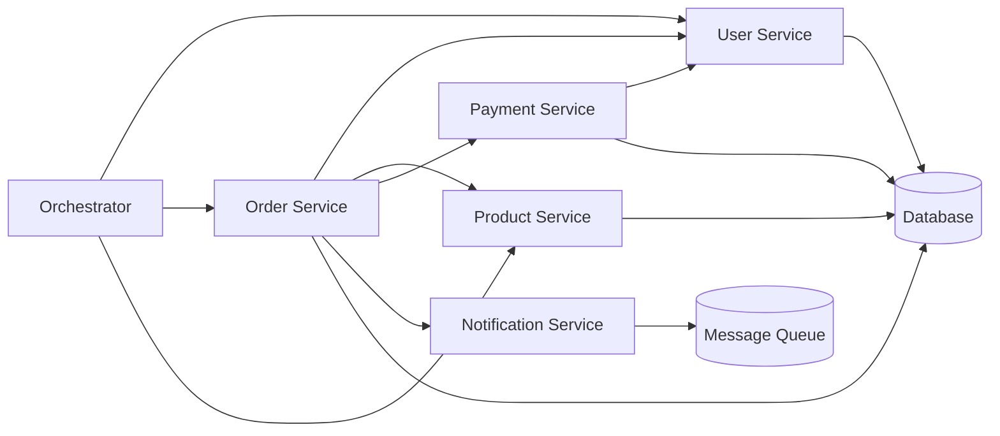
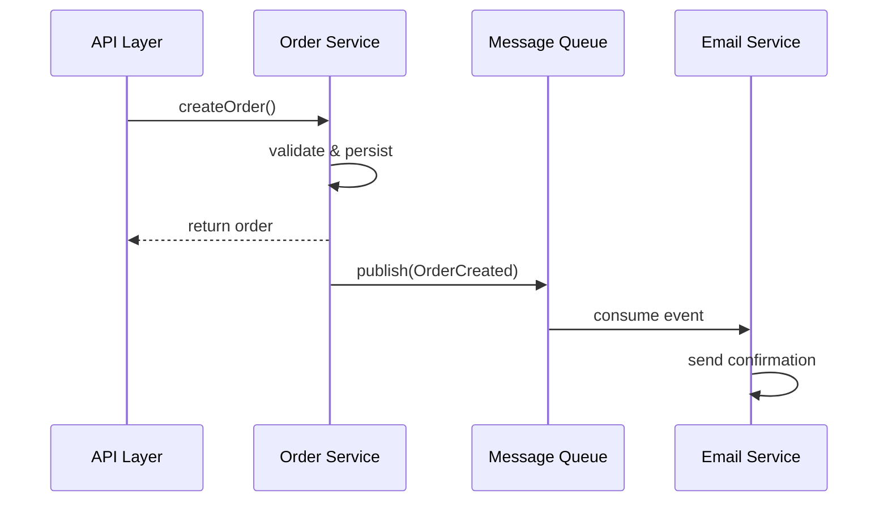

# Module Design Template

## Overview
**Project:** [Project Name]
**Architecture Pattern:** [Layered / Hexagonal / Clean / Microservices]
**Version:** 1.0.0
**Last Updated:** [Date]

---

## Architecture Diagram



---

## Layer Responsibilities

### Presentation Layer
**Responsibility:** Handle incoming requests and return responses

| Module | Responsibility | Technology |
|--------|----------------|------------|
| `WebAPI` | RESTful API endpoints | Express / FastAPI |
| `GraphQLAPI` | GraphQL query/resolver | Apollo / Graphene |
| `CLI` | Command-line interface | Commander / Click |

**Rules:**
- No business logic
- Request validation only
- Format responses
- Handle authentication middleware

---

### Application Layer
**Responsibility:** Coordinate domain operations and workflows

| Module | Responsibility |
|--------|----------------|
| `Orchestrator` | Coordinate multi-step workflows |
| `DTO Mapper` | Convert between DTOs and domain models |
| `Input Validator` | Validate incoming data |
| `Event Publisher` | Publish domain events |

**Rules:**
- Orchestrate domain operations
- No business rules
- Transaction management
- Cross-cutting concerns (logging, metrics)

---

### Domain Layer
**Responsibility:** Core business logic and rules

| Module | Responsibility |
|--------|----------------|
| `User Service` | User CRUD, authentication |
| `Order Service` | Order lifecycle, status transitions |
| `Product Service` | Product catalog, inventory |
| `Payment Service` | Payment processing, refunds |

**Rules:**
- Contains all business rules
- Independent of infrastructure
- No framework dependencies
- Testable in isolation

---

### Infrastructure Layer
**Responsibility:** External system integration

| Module | Responsibility |
|--------|----------------|
| `Database Repository` | Data persistence |
| `Cache Provider` | Caching operations |
| `Message Queue` | Async messaging |
| `External API Client` | Third-party integrations |

---

## Module Interface Specifications

### User Service Interface

```typescript
interface IUserService {
    // Create Operations
    createUser(data: CreateUserDTO): Promise<User>;

    // Read Operations
    getUserById(id: number): Promise<User | null>;
    getUserByEmail(email: string): Promise<User | null>;
    listUsers(filter: UserFilter): Promise<PaginatedResult<User>>;

    // Update Operations
    updateUser(id: number, data: UpdateUserDTO): Promise<User>;
    changePassword(id: number, oldPassword: string, newPassword: string): Promise<void>;

    // Delete Operations
    deleteUser(id: number): Promise<void>;
    deactivateUser(id: number): Promise<void>;

    // Authentication
    validateCredentials(email: string, password: string): Promise<User | null>;
    generateToken(user: User): Promise<string>;
}

interface CreateUserDTO {
    username: string;
    email: string;
    password: string;
    firstName?: string;
    lastName?: string;
}

interface UpdateUserDTO {
    firstName?: string;
    lastName?: string;
    isActive?: boolean;
}

interface UserFilter {
    page?: number;
    limit?: number;
    search?: string;
    isActive?: boolean;
}

interface User {
    id: number;
    username: string;
    email: string;
    firstName?: string;
    lastName?: string;
    isActive: boolean;
    createdAt: Date;
    updatedAt: Date;
}

interface PaginatedResult<T> {
    data: T[];
    pagination: {
        page: number;
        limit: number;
        total: number;
        totalPages: number;
    };
}
```

**Error Codes:**
| Code | Description |
|------|-------------|
| `USER_NOT_FOUND` | User does not exist |
| `USER_EXISTS` | User with email/username already exists |
| `INVALID_PASSWORD` | Password does not meet requirements |
| `AUTH_FAILED` | Invalid credentials |

---

### Order Service Interface

```typescript
interface IOrderService {
    // Order Operations
    createOrder(data: CreateOrderDTO): Promise<Order>;
    getOrderById(id: number): Promise<Order | null>;
    listOrders(filter: OrderFilter): Promise<PaginatedResult<Order>>;

    // Status Management
    updateStatus(id: number, status: OrderStatus, note?: string): Promise<Order>;
    cancelOrder(id: number, reason: string): Promise<Order>;

    // Order Items
    addItem(orderId: number, item: OrderItemDTO): Promise<OrderItem>;
    removeItem(orderId: number, itemId: number): Promise<void>;
    updateItemQuantity(orderId: number, itemId: number, quantity: number): Promise<OrderItem>;

    // Calculations
    calculateTotal(orderId: number): Promise<number>;
    applyDiscount(orderId: number, discountCode: string): Promise<Order>;
}

interface CreateOrderDTO {
    userId: number;
    items: OrderItemDTO[];
    shippingAddress: AddressDTO;
    billingAddress?: AddressDTO;
    discountCode?: string;
}

interface OrderItemDTO {
    productId: number;
    quantity: number;
    unitPrice: number;
}

interface AddressDTO {
    street: string;
    city: string;
    state: string;
    zipCode: string;
    country: string;
}

type OrderStatus = 'pending' | 'confirmed' | 'processing' | 'shipped' | 'delivered' | 'cancelled';

interface Order {
    id: number;
    orderNumber: string;
    userId: number;
    status: OrderStatus;
    totalAmount: number;
    discountAmount: number;
    shippingAddress: AddressDTO;
    items: OrderItem[];
    createdAt: Date;
    updatedAt: Date;
}
```

**State Machine:**


**Error Codes:**
| Code | Description |
|------|-------------|
| `ORDER_NOT_FOUND` | Order does not exist |
| `INVALID_STATUS` | Invalid status transition |
| `OUT_OF_STOCK` | Product insufficient quantity |
| `INVALID_DISCOUNT` | Discount code invalid or expired |

---

## Dependencies

### Module Dependency Graph



### Dependency Rules

| Layer | Can Depend On |
|-------|---------------|
| Presentation | Application, Domain |
| Application | Domain, Infrastructure interfaces |
| Domain | Nothing (core business) |
| Infrastructure | Nothing (implements interfaces) |

---

## Data Transfer Objects

### Request DTOs

```typescript
// DTOs are shared across layer boundaries
// They contain validation rules and serialization logic

class CreateUserRequestDTO {
    @IsString()
    @MinLength(3)
    @MaxLength(50)
    username: string;

    @IsEmail()
    email: string;

    @IsString()
    @MinLength(8)
    @Matches(/^(?=.*[a-z])(?=.*[A-Z])(?=.*\d)/)
    password: string;

    @IsOptional()
    @IsString()
    firstName?: string;

    @IsOptional()
    @IsString()
    lastName?: string;
}
```

### Response DTOs

```typescript
class UserResponseDTO {
    id: number;
    username: string;
    email: string;
    firstName?: string;
    lastName?: string;
    isActive: boolean;
    createdAt: string;
    updatedAt: string;

    // Excludes sensitive data like password
}
```

---

## Communication Patterns

### Synchronous Communication
- **Pattern:** Request/Response via direct method calls
- **Use Case:** Operations requiring immediate response
- **Example:** Creating an order, validating payment

### Asynchronous Communication
- **Pattern:** Event-driven via Message Queue
- **Use Case:** Background processing, notifications
- **Example:** Sending order confirmation email



---

## Cross-Cutting Concerns

### Logging
| Level | Use Case |
|-------|----------|
| ERROR | Exceptions, failures |
| WARN | Deprecated usage, potential issues |
| INFO | Business events, state changes |
| DEBUG | Detailed execution flow |

### Metrics
| Metric | Type | Description |
|--------|------|-------------|
| `request_count` | Counter | Total requests |
| `request_duration` | Histogram | Request latency |
| `active_orders` | Gauge | Current active orders |
| `error_rate` | Gauge | Error percentage |

### Caching Strategy
| Data | TTL | Eviction |
|------|-----|----------|
| User profile | 1 hour | LRU |
| Product catalog | 24 hours | Time-based |
| Order status | 5 minutes | LRU |

---

## Module Configuration

```yaml
# Module configuration example
modules:
  user_service:
    enabled: true
    endpoints:
      - /users
      - /auth
    dependencies:
      - database
      - cache

  order_service:
    enabled: true
    endpoints:
      - /orders
    dependencies:
      - database
      - message_queue
      - user_service
      - product_service
```
