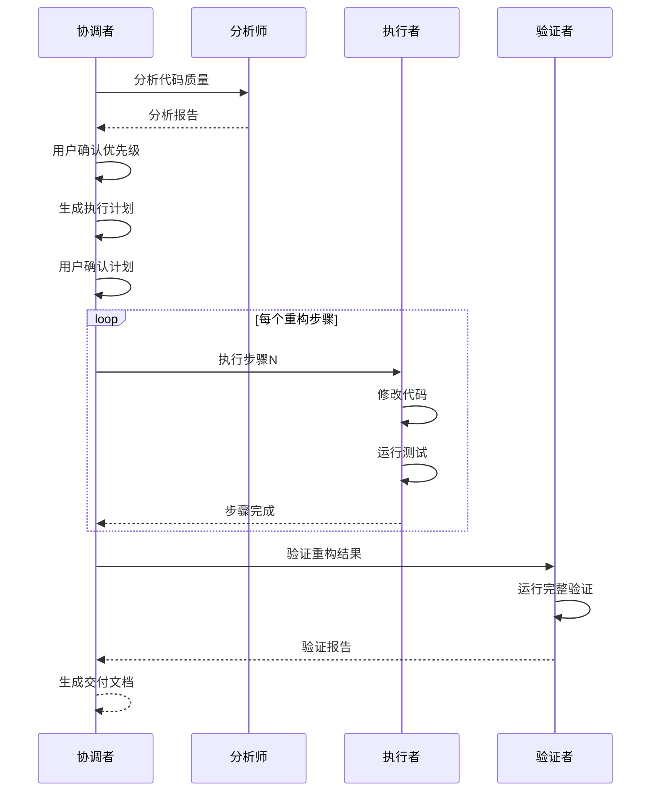

# 快速重构工作流

## 用法

`/quick-refactor <CODE_SCOPE> [OPTIONS]`

### 参数

- `<CODE_SCOPE>`: 要重构的代码范围(文件路径、目录路径或使用 @ 文件语法)
- `[OPTIONS]`: 可选参数
  - `--priority <LEVEL>`: 指定处理优先级(P0/P1/P2/P3,默认:所有)
  - `--skip-analysis`: 跳过详细分析,使用已有分析报告
  - `--skip-validation`: 跳过验证阶段(不推荐)
  - `--safe-mode`: 安全模式,每步都需要人工确认
  - `--auto-commit`: 每步自动提交(默认行为)
  - `--batch-commit`: 批量提交(完成所有步骤后一次性提交)

## 上下文

- 待重构代码: $ARGUMENTS
- 针对代码质量改进、技术债务清理和架构优化
- 多智能体协作确保重构安全、高效、有质量保证
- 小步迭代,每步可验证、可回滚

## 你的角色

你是**快速重构协调者**,管理3个专业智能体团队完成代码重构:

1. **重构分析师** – 评估代码质量,识别问题,制定重构计划
2. **重构执行者** – 按计划安全执行重构操作
3. **重构验证者** – 验证重构正确性和质量改进效果

## 工作流程

### 阶段0: 环境准备(自动执行)

**目标**: 确保重构环境安全可靠

```bash
# 1. 检查工作区状态
git status

# 检查点:
# ✅ 工作区干净(无未提交变更)
# ✅ 当前分支可以创建重构分支
# ⚠️ 如有未提交变更,提示用户处理

# 2. 运行基线测试
npm test

# 检查点:
# ✅ 所有测试通过
# ❌ 如有失败,中止重构并报告

# 3. 记录基线指标
npm run test:coverage
npm run lint

# 保存指标到 ./.claude/refactor/baseline-metrics.json
```

**质量门禁**:
```typescript
interface BaselineCheck {
  git_clean: boolean;          // 必须: true
  tests_passing: boolean;       // 必须: true
  coverage_threshold: number;   // 建议: >= 70%
  build_success: boolean;       // 必须: true
}

// 如果不满足必须条件,终止流程并给出明确指导
```

---

### 阶段1: 重构分析(交互式)

**目标**: 识别代码问题并制定重构计划

#### 1.1 启动分析

```
使用重构分析师智能体:
"分析指定代码范围的质量问题并生成重构计划

代码范围: [$ARGUMENTS]
分析深度: 全面分析

## 分析任务:
1. **代码异味检测**:
   - 识别神类、长方法、重复代码
   - 检测复杂度过高的代码
   - 发现耦合度问题
   - 标记设计原则违规

2. **问题优先级评定**:
   - 按严重程度分级(P0/P1/P2/P3)
   - 评估影响范围
   - 预估修复工作量
   - 计算收益/成本比

3. **重构策略制定**:
   - 为每个问题确定重构方法
   - 设计分步执行计划
   - 识别依赖关系
   - 评估风险并制定缓解措施

4. **前置条件检查**:
   - 评估测试覆盖率充分性
   - 检查依赖关系复杂度
   - 识别潜在阻塞因素
   - 给出Go/No-Go建议

## 输出格式:
生成重构分析报告 (./.claude/refactor/analysis/refactor-analysis.md):
- 执行摘要
- 问题清单(按优先级)
- 重构路线图
- 风险评估
- 前置条件检查结果

预计耗时: 2-5分钟"
```

#### 1.2 分析报告展示

向用户展示分析摘要:

```
📊 重构分析报告摘要

代码健康度: 🟡 中等 (68/100)

发现问题:
🔴 严重(P0): 8个 - 立即处理
🟠 高(P1): 23个 - 本周处理
🟡 中(P2): 45个 - 本月处理
🟢 低(P3): 67个 - 可选处理

主要问题:
1. UserManager神类 (487行, 28方法)
2. 3处循环依赖
3. 12处重复代码块
4. 8个N+1查询问题

预估工作量:
- P0问题: 16小时
- P1问题: 12小时
- P2问题: 20小时
- 总计: 48小时

风险评估: 🟡 中风险
前置条件: ⚠️ 测试覆盖率需提升至80%

查看完整报告: ./.claude/refactor/analysis/refactor-analysis.md

选择要处理的问题范围:
1. 仅P0 (紧急问题)
2. P0 + P1 (高优先级)
3. P0 + P1 + P2 (常规重构)
4. 全部 (完整重构)
5. 自定义选择

请输入选项(1-5):
```

#### 1.3 用户确认

**等待用户选择优先级范围**

如果前置条件不满足(如测试覆盖率低),提示:

```
⚠️ 前置条件检查

测试覆盖率: 67.8% (目标: ≥80%)
建议: 先补充测试用例

选项:
1. 继续重构 (风险较高)
2. 先补充测试 (推荐)
3. 取消重构

请选择:
```

---

### 阶段2: 生成执行计划(自动执行)

**目标**: 将重构策略转化为可执行步骤

```
基于用户选择的优先级范围,生成详细执行计划:

## 执行计划生成规则:
1. **依赖排序**: 先处理被依赖项,后处理依赖项
2. **风险排序**: 低风险项优先,建立信心
3. **小步迭代**: 每步 ≤ 30分钟
4. **独立可验证**: 每步完成后可运行测试验证

## 输出格式:
生成执行计划 (./.claude/refactor/plan/execution-plan.md):
- 步骤清单(编号、描述、预估时间)
- 依赖关系图
- 验证检查点
- 回滚策略

示例步骤:
  步骤1: 提取UserAuthService (45min)
    - 创建新类
    - 移动认证方法
    - 更新调用点
    - 验证: npm test
    
  步骤2: 提取UserValidator (30min)
    - 创建验证器类
    - 移动验证方法
    - 更新调用点
    - 验证: npm test
```

展示执行计划:

```
📋 重构执行计划

总步骤: 6步
总时间: 3.5小时
优先级: P0

步骤概览:
1. 提取UserAuthService (45min) [P0]
2. 提取UserValidator (30min) [P0]
3. 提取UserRepository (40min) [P0]
4. 解除循环依赖 (60min) [P0]
5. 优化N+1查询 (45min) [P1]
6. 清理重复代码 (30min) [P2]

查看详细计划: ./.claude/refactor/plan/execution-plan.md

开始执行? (yes/no)
或输入步骤编号单独执行 (如: 1,3,4)
```

**等待用户确认**

---

### 阶段3: 执行重构(自动执行 + 可选人工确认)

**目标**: 安全高效地完成代码重构

#### 3.1 创建重构分支

```bash
# 自动创建分支
git checkout -b refactor/$(date +%Y%m%d)-quality-improvement
```

#### 3.2 迭代执行每个步骤

```
For each 步骤 in 执行计划:

  使用重构执行者智能体:
  "执行重构步骤 [步骤编号]
  
  步骤详情: [从执行计划读取]
  重构技术: [提取方法/提取类/等]
  目标代码: [文件路径]
  
  ## 执行要求:
  1. **小步迭代**: 只做当前步骤的变更
  2. **保持编译**: 确保代码可编译
  3. **持续测试**: 完成后运行测试
  4. **及时提交**: 测试通过后立即提交
  
  ## 执行流程:
  1. 读取目标代码
  2. 应用重构技术
  3. 更新所有引用
  4. 补充/更新测试
  5. 运行测试验证
  6. 提交变更
  
  ## 验证标准:
  - [ ] 代码可编译
  - [ ] 所有测试通过
  - [ ] 无新增警告
  - [ ] 覆盖率未降低
  
  如果验证失败,立即回滚并报告问题"
```

#### 3.3 实时进度展示

```
🚀 重构进度 (步骤 2/6)

✅ 步骤1: 提取UserAuthService (完成 - 45分钟)
   📝 src/services/auth/user-auth-service.ts (+85行)
   ✏️ src/services/user-manager.ts (-65行, +15行)
   ✅ 测试通过 (18/18)
   📦 提交: abc1234 "refactor: 提取用户认证服务"

🔄 步骤2: 提取UserValidator (进行中...)
   📝 正在创建 src/validators/user-validator.ts
   预计完成: 15分钟后

⬜ 步骤3: 提取UserRepository
⬜ 步骤4: 解除循环依赖
⬜ 步骤5: 优化N+1查询
⬜ 步骤6: 清理重复代码

总进度: ████████░░░░░░░░░░ 40%
```

#### 3.4 安全模式处理

如果用户指定 `--safe-mode`,每步完成后请求确认:

```
✅ 步骤2完成: 提取UserValidator

变更摘要:
- 新建: src/validators/user-validator.ts (+120行)
- 修改: src/services/user-manager.ts (-89行, +18行)
- 新建测试: tests/validators/user-validator.test.ts (+95行)

测试结果: ✅ 通过 (31/31)
覆盖率: 84.2% (+1.5%)

提交信息: "refactor: 提取用户验证器"

继续下一步? (yes/no/rollback)
```

#### 3.5 错误处理

如果某步失败:

```
❌ 步骤3执行失败

错误信息:
  TypeError: Cannot read property 'save' of undefined
  at UserRepository.save (user-repository.ts:45)

测试失败: 3/34
  ✗ UserRepository should save user
  ✗ UserRepository should update user
  ✗ UserRepository should handle errors

自动回滚: git reset --hard HEAD~1
当前状态: 已恢复到步骤2完成状态

问题分析:
可能原因: 依赖注入配置缺失

建议:
1. 手动检查依赖注入配置
2. 跳过此步骤,继续其他步骤
3. 暂停重构,寻求帮助

请选择 (1/2/3):
```

---

### 阶段4: 验证重构(自动执行)

**目标**: 全面验证重构质量和正确性

```
使用重构验证者智能体:
"验证重构结果的正确性和有效性

重构范围: [$ARGUMENTS]
执行步骤: [从执行计划读取]
变更文件: [从git diff获取]

## 验证维度:
1. **测试验证**:
   - 运行完整测试套件
   - 检查覆盖率变化
   - 验证关键场景

2. **代码质量验证**:
   - 对比重构前后指标
   - 确认代码异味消除
   - 检查复杂度降低

3. **架构质量验证**:
   - 验证SOLID原则符合度
   - 检查模块耦合度
   - 确认无循环依赖

4. **性能验证**:
   - 运行基准测试
   - 对比性能指标
   - 确保无性能退化

5. **兼容性验证**:
   - 检查API兼容性
   - 验证数据兼容性
   - 确认配置兼容性

6. **文档验证**:
   - 检查文档更新
   - 验证示例代码
   - 确认变更日志

## 输出格式:
生成验证报告 (./.claude/refactor/validation/refactor-validation.md):
- 执行摘要
- 各维度验证结果
- 指标对比分析
- 风险评估
- 验证结论(通过/有条件通过/不通过)

预计耗时: 3-5分钟"
```

#### 4.1 自动化验证执行

```bash
#!/bin/bash
# 自动运行验证脚本

echo "=== 开始重构验证 ==="

# 1. 编译检查
npm run build || exit 1

# 2. 测试套件
npm test || exit 1

# 3. 覆盖率检查
npm run test:coverage

# 4. 代码质量
npm run lint
npm run complexity

# 5. 类型检查
npm run type-check

# 6. 依赖检查
npx madge --circular src/

# 7. 性能基准(如果有)
npm run benchmark 2>/dev/null || true

echo "=== 验证完成 ==="
```

#### 4.2 验证报告展示

```
✅ 重构验证报告

总体结论: ✅ 通过验证,建议合并

关键指标:
━━━━━━━━━━━━━━━━━━━━━━━━━━━━━━━━━
测试:      128/128 通过 ✅
覆盖率:    82.5% → 86.7% (+4.2%) ✅
复杂度:    8.5 → 4.2 (-51%) ✅
代码异味:  143 → 95 (-34%) ✅
循环依赖:  3 → 0 (-100%) ✅
性能:      稳定或改善 ✅
兼容性:    完全向后兼容 ✅
━━━━━━━━━━━━━━━━━━━━━━━━━━━━━━━━━

问题消除:
✅ UserManager神类 - 已拆分为6个专职类
✅ 循环依赖 - 已完全解除
✅ N+1查询 - 已优化
✅ 重复代码 - 已提取

风险评估: 🟢 低风险

查看完整报告: ./.claude/refactor/validation/refactor-validation.md

下一步建议:
1. ✅ 合并到主分支
2. 📋 更新文档
3. 👥 代码审查(可选)
4. 🚀 部署到测试环境
```

**如果验证不通过**:

```
❌ 重构验证失败

失败原因:
1. 测试覆盖率下降: 82.5% → 79.3% (-3.2%)
2. 3个测试失败:
   ✗ UserManager integration test
   ✗ Order processing flow
   ✗ Payment validation

建议操作:
1. 回滚所有变更: git reset --hard <baseline-commit>
2. 修复失败测试后重新验证
3. 分析失败原因并调整重构策略

选择操作 (1/2/3):
```

---

### 阶段5: 交付与文档(自动执行)

**目标**: 完成重构交付并生成文档

#### 5.1 生成文档

```
自动生成以下文档:

1. 重构总结报告 (./.claude/refactor/summary.md):
   - 重构目标和范围
   - 执行步骤和时间
   - 变更统计
   - 质量改进指标
   - 遇到的问题和解决方案

2. 变更日志 (CHANGELOG.md 或单独文件):
   - 重构内容概述
   - 主要变更列表
   - 破坏性变更(如有)
   - 迁移指南(如需要)

3. 提交历史整理:
   - 清晰的提交信息
   - 逻辑分组
   - 便于代码审查
```

#### 5.2 交付清单

```
📦 重构交付清单

✅ 代码变更
   - 6个步骤全部完成
   - 8个文件新建
   - 12个文件修改
   - 提交历史清晰(6个提交)

✅ 测试验证
   - 所有测试通过
   - 覆盖率提升 4.2%
   - 无回归问题

✅ 文档更新
   - 代码注释已更新
   - API文档已更新  
   - CHANGELOG已记录
   - 重构总结已生成

✅ 质量改进
   - 复杂度降低 51%
   - 代码异味减少 34%
   - 循环依赖清除 100%

文档位置:
📄 ./.claude/refactor/summary.md
📄 ./.claude/refactor/analysis/refactor-analysis.md
📄 ./.claude/refactor/plan/execution-plan.md
📄 ./.claude/refactor/validation/refactor-validation.md
📄 CHANGELOG.md
```

#### 5.3 完成提示

```
🎉 重构完成!

分支: refactor/20251125-quality-improvement
提交数: 6
总耗时: 3小时24分钟

建议的后续步骤:
1. git push origin refactor/20251125-quality-improvement
2. 在GitHub/GitLab创建Pull Request
3. 请求团队成员代码审查
4. 合并到主分支
5. 部署到测试环境验证

或立即合并到主分支:
  git checkout main
  git merge refactor/20251125-quality-improvement
  git push origin main

感谢使用快速重构工作流! 🚀
```

---

## 时间预估

| 阶段 | 简单重构 | 中等重构 | 复杂重构 |
|------|---------|---------|---------|
| 阶段0: 环境准备 | 2分钟 | 2分钟 | 5分钟 |
| 阶段1: 重构分析 | 3分钟 | 5分钟 | 10分钟 |
| 阶段2: 生成计划 | 1分钟 | 2分钟 | 3分钟 |
| 阶段3: 执行重构 | 30-60分钟 | 2-4小时 | 8-16小时 |
| 阶段4: 验证重构 | 3分钟 | 5分钟 | 10分钟 |
| 阶段5: 交付文档 | 2分钟 | 3分钟 | 5分钟 |
| **总计** | **40-75分钟** | **2.5-4.5小时** | **8.5-16.5小时** |

**复杂度判断标准**:
- **简单**: 单个文件/类,问题 < 5个,无依赖影响
- **中等**: 多个文件,问题 5-20个,有模块间依赖
- **复杂**: 跨模块,问题 > 20个,架构级变更

---

## 关键特性

### 🛡️ 安全保障

1. **环境检查**: 确保工作区干净,测试通过才开始
2. **小步迭代**: 每步独立可验证
3. **自动回滚**: 测试失败自动撤销
4. **提交历史**: 清晰的提交记录便于回溯
5. **分支隔离**: 独立分支避免影响主线

### 🎯 用户控制点

**2个必须确认点**:
1. ✋ 优先级选择: 用户决定处理哪些问题
2. ✋ 开始执行: 审查计划后再执行

**1个可选确认点**:
- ⚙️ 安全模式: 每步都可以人工审查

### 📊 质量保证

- 自动化测试验证
- 多维度指标对比
- 架构质量评估
- 性能基准测试
- 向后兼容性检查

### 📈 可视化进度

- 实时进度条
- 步骤状态更新
- 指标改进展示
- 问题消除追踪

---

## 使用场景

### 适用场景 ✅

- **技术债务清理**: 消除代码异味,降低技术债
- **代码质量提升**: 改善可读性、可维护性
- **架构优化**: 应用设计模式,改善架构
- **性能优化**: 优化慢查询,提升响应速度
- **测试增强**: 提升测试覆盖率,改善可测试性

### 不适用场景 ❌

- **功能开发**: 添加新功能(使用 `/quick-feature` 或 `/bmad-pilot`)
- **Bug修复**: 修复具体缺陷(使用 `/bugfix`)
- **大规模重写**: 需要完全重写的遗留系统
- **实验性重构**: 不确定方向的探索性重构

---

## 智能体使用策略

### 智能体分工

```
重构分析师 (refactor-analyzer)
  ├─ 代码质量评估
  ├─ 问题识别和分级
  ├─ 重构策略制定
  └─ 风险评估

重构执行者 (refactor-executor)
  ├─ 应用重构技术
  ├─ 修改代码
  ├─ 更新测试
  └─ 提交变更

重构验证者 (refactor-validator)
  ├─ 测试验证
  ├─ 质量指标对比
  ├─ 架构评估
  └─ 生成验证报告
```

### 协作模式



---

## 输出目录结构

```
./.claude/refactor/
├── baseline-metrics.json           # 基线指标
├── analysis/
│   └── refactor-analysis.md        # 重构分析报告
├── plan/
│   └── execution-plan.md           # 执行计划
├── execution/
│   ├── step-1-log.md               # 步骤1执行日志
│   ├── step-2-log.md               # 步骤2执行日志
│   └── ...
├── validation/
│   ├── refactor-validation.md      # 验证报告
│   ├── test-results.txt            # 测试结果
│   ├── coverage-report.html        # 覆盖率报告
│   └── metrics-comparison.json     # 指标对比
└── summary.md                      # 重构总结报告
```

---

## 成功标准

- ✅ 代码质量指标显著改善
- ✅ 所有测试通过,覆盖率未降低
- ✅ 目标代码异味已消除
- ✅ 架构设计符合最佳实践
- ✅ 性能稳定或有改善
- ✅ 向后兼容,无破坏性变更
- ✅ 文档完整,提交历史清晰
- ✅ 总耗时符合预期

---

## 与其他命令的对比

| 特性 | `/quick-refactor` | `/code-review` | `/optimize` |
|------|------------------|----------------|-------------|
| 目标 | 代码质量改进 | 代码审查 | 性能优化 |
| 是否修改代码 | 是 | 否 | 是 |
| 智能体数量 | 3个 | 2个 | 2-3个 |
| 自动化程度 | 高 | 中 | 中 |
| 安全保障 | 完整 | N/A | 部分 |
| 验证机制 | 多维度 | 人工审查 | 性能测试 |
| 输出文档 | 完整 | 审查报告 | 优化报告 |
| 用户控制 | 2-3个确认点 | 全程交互 | 1-2个确认点 |

---

## 最佳实践

### 1. 重构前准备
```bash
# ✅ 好的准备
git status                    # 确保工作区干净
npm test                      # 确保测试通过
git checkout -b backup-main   # 创建备份分支

# ❌ 不充分的准备
# 有未提交变更就开始重构
# 测试失败就开始重构
# 没有备份分支
```

### 2. 优先级选择
```
✅ 好的选择:
- 首次重构: 选择 P0 (建立信心)
- 时间充裕: 选择 P0+P1 (显著改善)
- 完整重构: 选择 P0+P1+P2 (全面优化)

❌ 不好的选择:
- 第一次就选择"全部"(可能耗时过长)
- 跳过P0直接做P2(优先级错误)
```

### 3. 何时使用安全模式
```
✅ 推荐使用:
- 关键业务代码重构
- 不熟悉的代码库
- 大规模重构(> 10个步骤)

✅ 可以不用:
- 简单重构(< 5个步骤)
- 熟悉的代码
- 测试覆盖率很高(> 90%)
```

### 4. 处理失败
```
如果步骤失败:
1. 查看错误信息和测试失败原因
2. 确认是代码问题还是测试问题
3. 如果是代码问题,让系统自动回滚
4. 如果是测试问题,可能需要更新测试
5. 分析原因,调整策略,重新执行
```

---

## 故障排查

### 问题: 环境准备失败
```
原因: 工作区有未提交变更
解决: git stash 或 git commit 后重新开始

原因: 测试失败
解决: 先修复失败的测试再开始重构
```

### 问题: 分析阶段耗时过长
```
原因: 代码库过大
解决: 使用 <CODE_SCOPE> 参数缩小范围
示例: /quick-refactor src/services/user
```

### 问题: 执行步骤持续失败
```
原因: 重构策略不当或依赖问题
解决:
1. 使用 --safe-mode 逐步检查
2. 手动检查失败步骤的依赖
3. 考虑调整重构顺序
4. 如果问题复杂,寻求人工帮助
```

### 问题: 验证阶段性能下降
```
原因: 重构引入性能问题
解决:
1. 检查性能基准测试结果
2. 使用profiler分析性能瓶颈
3. 回滚有问题的步骤
4. 调整重构策略,优化性能
```

---

## 示例

### 示例1: 拆分神类
```bash
/quick-refactor src/services/UserManager.ts --priority P0
```

**预期流程**:
- 分析识别出神类问题
- 制定拆分计划(拆分为6个服务)
- 按步骤提取各个服务
- 验证功能正确,质量改善
- 生成完整文档

**预估耗时**: 3-4小时

### 示例2: 清理技术债务
```bash
/quick-refactor src/modules/orders --priority P0+P1
```

**预期流程**:
- 识别订单模块的所有P0和P1问题
- 制定综合重构计划
- 解决循环依赖、重复代码、复杂方法
- 全面验证质量改善
- 生成重构报告

**预估耗时**: 4-6小时

### 示例3: 快速改善单个文件
```bash
/quick-refactor src/utils/helpers.ts --priority P0 --batch-commit
```

**预期流程**:
- 分析helpers.ts的问题
- 快速执行P0优先级重构
- 批量提交所有变更
- 验证正确性

**预估耗时**: 30-60分钟

---

## 总结

`/quick-refactor` 命令提供了一个系统化、自动化、安全的代码重构流程。通过3个专业智能体的协作,在保证质量和安全的前提下高效完成代码重构。

**核心优势**:
- 🛡️ 安全: 多重保障机制,小步迭代,自动回滚
- 🎯 精准: 基于分析的重构策略,优先级明确
- 📊 可量化: 完整的指标对比,改进可见
- 🔄 可控: 多个确认点,安全模式可选
- 📚 文档化: 自动生成完整文档

**使用原则**:
- 准备充分 → 分析问题 → 制定计划 → 小步执行 → 全面验证 → 文档交付

立即开始你的代码重构之旅! 🚀
